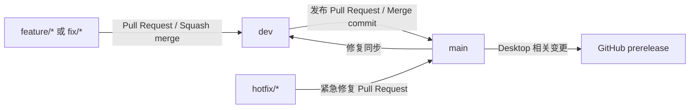

# Inkwell 开发与分支工作流

本文档说明 Inkwell 的日常开发、Pull Request、发布和紧急修复流程。仓库采用轻量双分支模型：`dev` 用于功能集成，`main` 用于稳定发布；实际开发必须在短生命周期分支上进行。

## 1. 分支模型



| 分支         | 用途                 | 是否允许直接开发 | 合并方式                         |
| ------------ | -------------------- | ---------------- | -------------------------------- |
| `main`       | 稳定与发布分支       | 否               | `dev` 发布 PR 使用 Merge commit  |
| `dev`        | 日常功能集成分支     | 否               | 功能 PR 通常使用 Squash merge    |
| `feature/*`  | 新功能开发           | 是               | PR 到 `dev`                      |
| `fix/*`      | 非紧急缺陷修复       | 是               | PR 到 `dev`                      |
| `refactor/*` | 不改变外部行为的重构 | 是               | PR 到 `dev`                      |
| `docs/*`     | 文档修改             | 是               | PR 到 `dev`                      |
| `chore/*`    | 依赖、构建和工程维护 | 是               | PR 到 `dev`                      |
| `hotfix/*`   | 已发布版本的紧急修复 | 是               | PR 到 `main`，合并后同步回 `dev` |

`main` 和 `dev` 均受 GitHub ruleset 保护：禁止删除和强制推送，修改必须通过 Pull Request，并要求 `encoding-check` 成功和 Review 对话全部解决。仓库当前不要求批准票数，避免单维护者无法批准自己的 PR。

## 2. 开始新功能

### 2.1 更新本地 `dev`

开始任何常规开发前，先从远端更新 `dev`：

```bash
git switch dev
git pull --ff-only origin dev
```

`--ff-only` 可以防止一次普通拉取意外创建本地 merge commit。如果命令失败，先检查本地是否有未提交改动或分支是否已经产生分叉，不要直接改用强制操作。

### 2.2 创建功能分支

从最新 `dev` 创建短生命周期分支：

```bash
git switch -c feature/agent-management
```

分支名使用小写 kebab-case，并表达具体目的，例如：

```text
feature/agent-management
fix/conversation-title
refactor/model-registry
docs/local-development
chore/update-electron
```

不要直接在 `dev` 或 `main` 上开发。一个分支应只承担一个可独立审查的目标。

## 3. 开发与本地验证

开发期间经常检查工作区：

```bash
git status
git diff
```

提交前运行与改动范围匹配的构建和测试。常见命令如下：

```bash
# 完整 .NET 构建
dotnet build Inkwell.slnx

# 指定 .NET 测试项目
dotnet test tests/<TestProject>/<TestProject>.csproj

# Desktop 构建
npm --prefix src/app/desktop ci
npm --prefix src/app/desktop run build

# 检查 diff 中的空白错误
git diff --check
```

C# 代码修改后必须运行对应的 `dotnet build`。新增或修改行为时，应增加并运行覆盖该行为的测试。不要为了让当前 PR 通过而顺手修复无关问题；发现无关缺陷时另开 Issue 或分支。

## 4. 提交变更

只暂存本次改动涉及的文件：

```bash
git add path/to/file1 path/to/file2
git diff --cached
git commit -m "feat: add agent management"
```

推荐使用 Conventional Commits 风格：

| 前缀       | 用途                 | 示例                                 |
| ---------- | -------------------- | ------------------------------------ |
| `feat`     | 新功能               | `feat: add agent management`         |
| `fix`      | 缺陷修复             | `fix: preserve conversation title`   |
| `refactor` | 重构                 | `refactor: simplify model registry`  |
| `test`     | 测试                 | `test: cover agent deletion`         |
| `docs`     | 文档                 | `docs: describe local development`   |
| `ci`       | GitHub Actions 和 CI | `ci: validate desktop pull requests` |
| `chore`    | 依赖或工程维护       | `chore: update Electron`             |

提交标题应描述结果，而不是使用“update files”一类模糊表述。提交前确认没有密钥、Token、密码、本地配置或生成产物被意外暂存。

所有提交都必须使用 Conventional Commits 标题。是否要求提交正文包含 `Design` / `Tests` / `Verify` / `Docs` / `Risk` / `Task` 六字段，按改动性质判断：

- **强制六字段**：存在正式任务简报、关联设计或测试编号，或者改动涉及产品代码、测试代码、架构/详细设计与数据库结构；
- **可省略六字段**：没有正式追溯要求的轻量 `docs` / `chore` 变更，且不包含产品代码、测试代码、架构/详细设计或数据库结构改动；
- **混合改动从严处理**：只要同一提交包含任一强制场景，整个提交必须提供六字段，不得通过使用 `docs` / `chore` 前缀规避追溯要求。

可省略六字段不等于免除说明责任：PR 描述仍必须写明改动目的、验证结果、文档影响与风险。无法明确分类时按强制六字段处理，或在提交前交由 H5 CommitAuditor 判断。

需要六字段时，提交正文示例：

```text
feat: add agent management

Design: HD-015
Tests: TC-AGENT-001, TC-AGENT-002
Verify: dotnet test tests/Inkwell.Core.Tests/Inkwell.Core.Tests.csproj
Docs: no change
Risk: agent authorization path changed
Task: TASK-042
```

## 5. 推送并创建功能 PR

首次推送功能分支：

```bash
git push --set-upstream origin feature/agent-management
```

创建目标为 `dev` 的 Pull Request：

```bash
gh pr create \
  --base dev \
  --head feature/agent-management \
  --title "feat: add agent management" \
  --body "实现 Agent 管理功能，并补充对应测试。"
```

PR 描述至少包含：

- 改动内容和目的；
- 关键实现或设计取舍；
- 实际运行的验证命令和结果；
- 已知风险、未覆盖范围或后续工作；
- 适用时关联 `REQ-NNN`、`HD-NNN`、`API-NNN`、`DB-NNN` 或 Issue。

PR 创建后：

1. 等待 required checks 成功；
2. 处理 Review 意见并解决所有对话；
3. 如果 `dev` 已前进，先更新功能分支并重新验证；
4. 使用 **Squash and merge** 合入 `dev`，让一个功能在集成分支上形成一个清晰提交。

不要将面向 `dev` 的普通功能 PR 改为面向 `main`，这样会绕过集成阶段并可能触发发布。

### 5.1 CI/CD 触发规则

Workflow 由事件类型、目标分支和路径过滤共同决定。“PR 到 `dev`”表示 `pull_request` 事件的目标分支（base branch）是 `dev`，不等于合并后由一次 `push dev` 事件触发。

| 操作 | `encoding-check` | Desktop 构建 / 发布 | GitHub Pages |
| --- | --- | --- | --- |
| 首次 push 尚未创建 PR 的短生命周期分支 | 不触发 | 不触发 | 不触发 |
| 创建或更新目标为 `dev` / `main` 的 PR | 必定运行 | 仅改动 `src/app/desktop/**` 或 Desktop workflow 自身时构建三平台 Artifact；不发布 | 不触发 |
| PR 合入 `dev` | 不因 `push dev` 重跑 | 不因 `push dev` 重跑 | 不触发 |
| PR 合入 `main`，或其他合规方式产生 `push main` | 必定运行 | 路径匹配时构建并创建 GitHub prerelease | 路径匹配时构建并部署站点 |

PR 创建后继续向 Head 分支 push，会产生 PR 更新事件，并重新运行该 PR 适用的检查。当前 ruleset 的 required check 只有 `encoding-check`；Desktop 三平台构建即使不是 required check，涉及 Desktop 的 PR 也应在合并前确认其成功。

Pages 自动发布仅在 `main` 收到 push 且改动包含 `site/**` 或 [Pages workflow](.github/workflows/pages.yml) 自身时触发。常规流程中，这通常发生在相关改动通过 `dev -> main` 发布 PR 合入之后；面向 `dev` 或 `main` 的 PR 本身不会构建或发布 Pages，合入 `dev` 也不会发布。

Pages 还支持从 GitHub Actions 页面手动运行（`workflow_dispatch`）。手动运行不受路径过滤限制，并会构建所选 Git ref 的 `site/` 内容；正式站点发布应选择 `main`，避免把未进入稳定分支的内容部署到线上。

## 6. 更新存在冲突的功能分支

优先使用 rebase 将最新 `dev` 整理到尚未共享或只有自己使用的功能分支：

```bash
git fetch origin
git switch feature/agent-management
git rebase origin/dev
```

解决冲突并验证后，因为 rebase 改写了功能分支历史，需要安全地更新远端：

```bash
git push --force-with-lease
```

`--force-with-lease` 只适用于不受保护的短生命周期分支。禁止对 `main` 或 `dev` 使用 force push。多人共享同一功能分支时，不要擅自 rebase；改用合并 `origin/dev` 或先与协作者确认。

## 7. 功能合入后的清理

PR 合入 `dev` 后更新本地分支并删除已完成的功能分支：

```bash
git switch dev
git pull --ff-only origin dev
git branch -d feature/agent-management
git push origin --delete feature/agent-management
```

如果 `git branch -d` 提示分支未合并，先确认 PR 是否确实合入以及是否采用了 Squash merge。Squash merge 后 Git 可能无法根据提交祖先关系识别原分支；确认内容已合入后可以删除本地功能分支，但不要在未核实前使用强制删除。

## 8. 从 `dev` 发布到 `main`

当 `dev` 上的一组功能已经完成集成验证后，创建发布 PR：

```bash
gh pr create \
  --base main \
  --head dev \
  --title "release: promote dev to main" \
  --body "将 dev 中已完成验证的改动发布到 main。"
```

发布 PR 应汇总本批次功能、验证结果、数据库或配置变化、部署注意事项和已知风险。等待所有检查成功后，使用 **Create a merge commit** 合入，保留 `dev` 到 `main` 的清晰祖先关系；不要对整个 `dev -> main` 发布 PR 使用 Squash merge。

Desktop 相关改动进入 `main` 后，[desktop-release workflow](.github/workflows/desktop-release.yml) 会自动：

1. 生成 `v<base-version>.<7位提交号>` 格式的 Tag；
2. 构建 Windows、macOS 和 Linux 安装包；
3. 生成 `SHA256SUMS.txt`；
4. 创建 GitHub prerelease。

面向 `dev` 或 `main` 的 Desktop PR 只构建验证 Artifact，不创建 Tag 或 Release。各 workflow 的完整触发条件见 [§5.1 CI/CD 触发规则](#51-cicd-触发规则)。

## 9. 发布后同步 `dev`

`dev -> main` 使用 merge commit 后，`main` 会比 `dev` 多一个发布合并提交。为了让后续发布 PR 保持最新，可通过 GitHub 的 **Update branch** 将 `main` 同步回 `dev`，或创建一个 `main -> dev` 同步 PR。

由于 `dev` 受保护，不能直接将本地同步结果 push 到 `dev`。推荐创建同步分支：

```bash
git fetch origin
git switch -c chore/sync-main-to-dev origin/main
git push --set-upstream origin chore/sync-main-to-dev
gh pr create \
  --base dev \
  --head chore/sync-main-to-dev \
  --title "chore: sync main into dev" \
  --body "同步最新发布合并提交到 dev。"
```

如果 `main` 除发布 merge commit 外没有独立改动，短期内 `main` 和 `dev` 的文件内容仍可能完全一致；提交图不同并不代表代码丢失。

## 10. 紧急修复

只有需要绕过正常发布批次的紧急生产问题才使用 `hotfix/*`。从最新 `main` 创建分支：

```bash
git switch main
git pull --ff-only origin main
git switch -c hotfix/login-crash
```

完成修改、测试并推送后，创建 `hotfix/login-crash -> main` PR。检查通过后合入 `main`，让发布工作流生成修复版本。随后必须将修复同步到 `dev`，可创建 `main -> dev` 同步 PR，避免下一次发布覆盖或丢失热修复。

普通缺陷仍从 `dev` 创建 `fix/*`，不要滥用 hotfix 流程。

## 11. 常见场景

### 当前在 `main`，准备开发

不要直接修改。执行：

```bash
git switch dev
git pull --ff-only origin dev
git switch -c feature/<功能名称>
```

### 已经在 `main` 上产生未提交修改

如果修改尚未提交，可以直接创建功能分支保留工作区内容：

```bash
git switch -c feature/<功能名称>
```

然后确认该分支是否确实基于合适的 `dev` 提交。如果 `main` 与 `dev` 已有内容差异，应先暂存或提交工作，再基于 `dev` 整理分支，避免把仅属于 `main` 的提交带入功能 PR。

### PR 显示分支落后

先获取远端并更新功能分支：

```bash
git fetch origin
git switch feature/<功能名称>
git rebase origin/dev
git push --force-with-lease
```

如果是 `dev -> main` 发布 PR，优先使用 GitHub 的 **Update branch** 或按第 9 节创建同步 PR，不要强推受保护分支。

### 直接 push 被拒绝

这是分支保护的预期行为。确认当前分支：

```bash
git branch --show-current
```

如果在 `main` 或 `dev`，创建新的功能分支后再提交和推送。不要尝试关闭保护规则或使用 force push 绕过流程。

### 只有 Desktop 文件变化时 CI 很慢

Desktop PR 会构建 Windows、macOS 和 Linux 安装包，这是发布前的真实验证。三平台构建成功后，PR Artifact 可用于测试；只有改动进入 `main` 才会创建 prerelease。

## 12. 禁止事项

- 不直接在 `main` 或 `dev` 上开发或 push；
- 不对 `main` 或 `dev` force push；
- 不绕过失败的 required checks；
- 不把普通功能 PR 直接提交到 `main`；
- 不把多个无关功能塞进同一个分支或 PR；
- 不提交密钥、Token、密码、`.env` 私密内容或本地 User Secrets；
- 不为通过当前 PR 而修改无关代码或测试；
- 不在没有同步回 `dev` 的情况下结束 hotfix 流程。

## 13. AI 工具执行约束

仓库内的 AI 工具同样必须遵守本文档，不得因为自动化执行而绕过分支保护：

- [`AGENTS.md`](AGENTS.md) 保存跨 AI 工具通用的分支边界；
- [`.github/copilot-instructions.md`](.github/copilot-instructions.md) 要求默认 Copilot 在首次编辑前检查并切换到合规短分支；
- [H5 CodingExecutor](.github/agents/h5-coding-executor.agent.md) 在 `main` 或 `dev` 上必须阻塞返回，不得开始编码；
- [H5 CommitAuditor](.github/agents/h5-commit-auditor.agent.md) 必须审计 PR 的 Head / Base 分支流向。

完整流程只在本文档维护。其他 instructions 和 agent 文件只保留必要门禁与本文档链接，禁止复制整套流程，避免多份规则随时间产生冲突。任何 AI 工具都不得临时关闭 ruleset、绕过 required checks、强推受保护分支或替 Owner 降低保护强度。

## 14. 快速检查清单

开始开发：

- [ ] 已切换并更新 `dev`；
- [ ] 已从 `dev` 创建语义清晰的短生命周期分支；
- [ ] 工作区不包含其他任务的遗留修改。

创建 PR 前：

- [ ] 改动范围单一且可审查；
- [ ] 已运行对应构建和测试；
- [ ] `git diff --check` 成功；
- [ ] 没有提交密钥、生成物或本地配置；
- [ ] PR 目标分支正确：常规开发为 `dev`，紧急修复才是 `main`。

合并前：

- [ ] required checks 全部成功；
- [ ] Review 对话全部解决；
- [ ] PR 分支已基于最新目标分支；
- [ ] 功能 PR 使用 Squash merge；
- [ ] `dev -> main` 发布 PR 使用 Merge commit。
