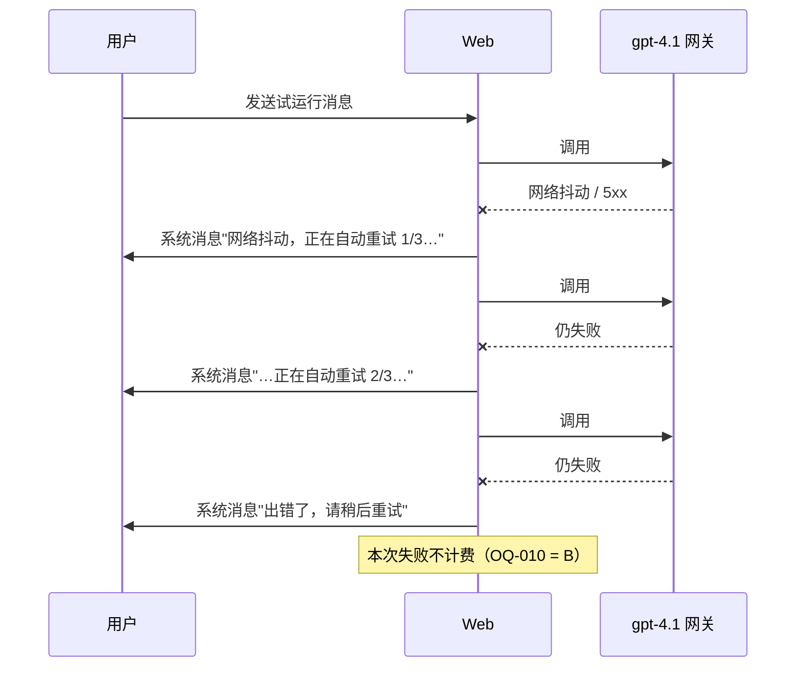
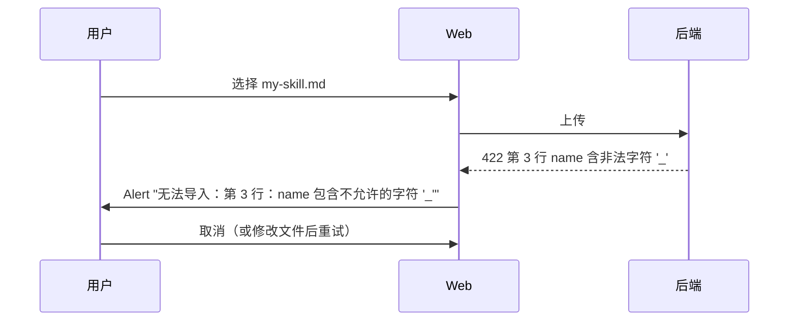
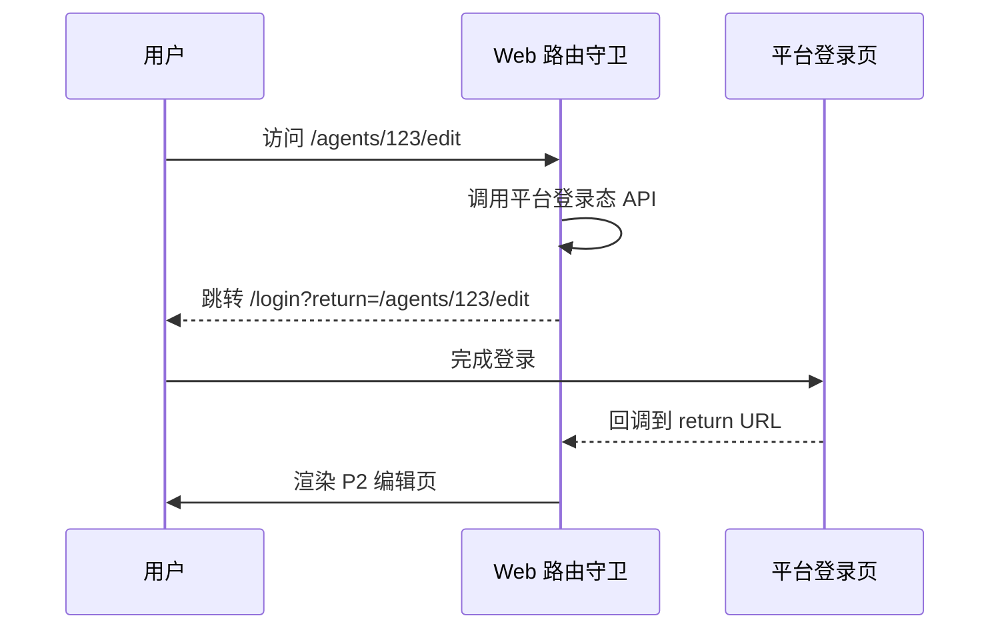

# 自定义 Agent 功能 · H1 用户流程

> 本文档把 [ui-spec.md](./ui-spec.md) 里的 P1 ~ P5 串成 4 条主流程 + 3 条异常流程，并把每一步与 [requirements.md](./requirements.md) 的 `REQ-NNN / AC-NNN-N / E-N` 对齐。流程图均使用 Mermaid，便于在 PR 中评审与回写。

## 1. 主流程清单

| 编号 | 流程                       | 触发                        | 主要 REQ                  |
| ---- | -------------------------- | --------------------------- | ------------------------- |
| F1   | 新建 Agent → 试运行 → 保存 | P1 点"新建 Agent"           | REQ-001 / 002 / 003 / 004 |
| F2   | 装一个 Skill               | P2 Skill tab 点"新建 Skill" | REQ-010                   |
| F3   | 启用一个内置 Tool          | P2 Tool tab 勾选 T-1        | REQ-011 / E6              |
| F4   | 软删除 + 恢复              | P1 卡片"删除"               | REQ-001 / DB-004          |

异常流程：

| 编号 | 流程                   | 触发                |
| ---- | ---------------------- | ------------------- |
| FE1  | 试运行重试 3 次失败    | 网络抖动 / 模型 5xx |
| FE2  | 导入 SKILL.md 解析失败 | 用户上传非法文件    |
| FE3  | 未登录访问任意路由     | 浏览器 cookie 过期  |

## 2. F1 新建 Agent → 试运行 → 保存

```mermaid
flowchart TD
    A[P1 列表页] -->|点"新建 Agent"<br/>AC-001-1| B[P2 编辑页 · 空白态]
    B --> C{填基本信息}
    C -->|名称 ≤ 50 字符<br/>AC-002-5| D[左栏：名称/头像/描述]
    C -->|Instructions<br/>AC-003-1| E[中栏：Instructions 编辑器]
    D --> F[下半屏：试运行]
    E --> F
    F -->|发送消息<br/>AC-004-1| G[gpt-4.1 调用<br/>NFR-005 计入主桶]
    G -->|成功| H[聊天气泡显示回复]
    G -->|失败 1~3 次| I[E1 自动重试]
    I -->|3 次内成功| H
    I -->|3 次失败| J[E1 系统消息<br/>"出错了，请稍后重试"]
    H --> K{满意？}
    K -->|是| L[点 保存]
    K -->|否| C
    L -->|后端校验| M{保存成功？}
    M -->|是| N[Toast<br/>"已保存"]
    M -->|否| O[Alert<br/>"保存失败：<原因>"]
    N --> A
```

**关键节点验收**：

- A→B：列表页"新建 Agent"按钮 always 可点击（AC-001-1）。
- C→F：试运行下半屏始终可见，无需切 tab（AC-004-3）。
- F→G：试运行调用使用当前**未保存**的 Instructions 与已勾选 Skill / Tool（AC-004-1、AC-010-7、AC-011-4）。
- L→M：保存动作仅写库，不触发额外计费。

## 3. F2 装一个 Skill

```mermaid
flowchart TD
    A[P2 Skill tab] --> B{选择来源}
    B -->|"新建 Skill"| C[P3 抽屉 · 空白]
    B -->|"导入 SKILL.md"| D[文件选择器<br/>仅 .md 单选]
    D --> E{后端解析}
    E -->|失败| F[E7 Alert<br/>"第 N 行：<具体错误>"]
    F --> D
    E -->|成功且重名| G[ConfirmModal<br/>覆盖现有 / 另存为新名称]
    G -->|覆盖现有<br/>OQ-028 D2| H[保存到用户级 Skill 库<br/>DB-006]
    G -->|另存为新名称| I[改 name 后再保存]
    I --> H
    E -->|成功且不重名| H
    C --> J[填 frontmatter 字段<br/>AC-010-2]
    J -->|name 校验<br/>^[a-z0-9](?:[a-z0-9-]*[a-z0-9])?$| K{校验通过?}
    K -->|否| L[字段下方红字提示]
    L --> J
    K -->|是| M[填 Markdown body]
    M --> N[点 保存]
    N --> H
    H --> O[抽屉关闭<br/>Skill tab 列表刷新]
    O --> P{用户在 Agent 上勾选?}
    P -->|是| Q[Agent 引用此 Skill<br/>AC-010-5 F3]
    P -->|否| R[Skill 留在用户库<br/>不影响当前 Agent]
```

**关键节点验收**：

- B→C / B→D：用户视角下"新建" 与"导入"是平级动作（AC-010-2、AC-010-3）。
- F→D：解析失败后停留在导入对话框，不清空已选文件（E7）。
- H：保存到**用户级** Skill 库，不直接拷到 Agent（DB-006）。
- P→Q：Agent 上只存引用 ID + 当前版本号（DB-006，F3）。

## 4. F3 启用一个内置 Tool

```mermaid
flowchart TD
    A[P2 Tool tab] --> B{勾选哪个工具?}
    B -->|T-1 联网搜索| C{首次启用?}
    B -->|T-3 当前日期| D[直接启用<br/>不弹须知]
    C -->|是| E[E6 Modal<br/>"本工具会把对话发送给搜索服务方"]
    C -->|否| F[直接启用]
    E -->|点 我知道了| G[标记本用户已确认<br/>DB-007]
    G --> F
    E -->|点 取消| H[勾选恢复未选]
    F --> I[Tool tab 显示已启用]
    D --> I
    I --> J{在试运行中触发?}
    J -->|模型决定调用 T-1| K[发起搜索请求<br/>R8 第三方依赖]
    K -->|成功| L[结果回流入对话<br/>token 计入主桶 NFR-005]
    K -->|失败 1~3 次| M[E1 自动重试<br/>AC-011-5]
    M -->|3 次内成功| L
    M -->|3 次失败| N[E1 系统消息<br/>本次试运行不影响后续轮次]
    J -->|模型决定不调用| O[正常回复]
```

**关键节点验收**：

- C→E：每个用户 × 每个会外发工具的"首次启用"只触发一次须知（E6、DB-007）。
- E→H：用户拒绝时勾选恢复，**不**保存为已启用（AC-011-3）。
- M→N：Tool 调用失败不阻塞对话流（AC-011-5）。

## 5. F4 软删除 + 恢复

```mermaid
flowchart TD
    A[P1 列表页 · 全部 tab] -->|卡片"删除"| B[P4 ConfirmModal]
    B -->|取消| A
    B -->|确认| C[后端软删除<br/>DB-004 7 天 hold]
    C --> D[Toast<br/>"已移到已删除，7 天内可恢复"]
    D --> A
    A -->|切到 已删除 tab| E[P1 · 已删除列表]
    E -->|"恢复"| F[后端恢复]
    F --> G[Toast"已恢复 <名称>"]
    G --> E
    E -->|"永久删除"| H[二次 ConfirmModal<br/>type=danger]
    H -->|取消| E
    H -->|确认| I[后端硬删除]
    I --> J[卡片移除<br/>不可逆]
    C -->|7 天后定时任务| I
```

**关键节点验收**：

- B→C：软删除后该 Agent 在 `全部` tab 立即消失（DB-002）。
- C→D：Toast 文案需明示 7 天 hold（DB-004）。
- E→F：恢复后 Agent 回到 `全部` tab，最近更新时间不变。
- C→I（7 天定时任务）：到期硬删除不需要用户确认（DB-004）。

## 6. 异常流程

### FE1 试运行重试 3 次失败



### FE2 导入 SKILL.md 解析失败



### FE3 未登录访问任意路由



## 7. 流程矩阵汇总（与 REQ 反向链）

| REQ     | 命中流程                              |
| ------- | ------------------------------------- |
| REQ-001 | F1（创建）、F4（删除 / 恢复）         |
| REQ-002 | F1（基本信息编辑）                    |
| REQ-003 | F1（Instructions 编辑）               |
| REQ-004 | F1（试运行）、FE1                     |
| REQ-010 | F2、FE2                               |
| REQ-011 | F3                                    |
| REQ-012 | （UI 占位，无主动流程；MCP tab 灰显） |
| DB-004  | F4                                    |
| E1      | FE1                                   |
| E6      | F3                                    |
| E7      | FE2                                   |
| R7      | FE3                                   |

## 8. 变更记录

| 版本 | 日期       | 作者                       | 变更                                                                    |
| ---- | ---------- | -------------------------- | ----------------------------------------------------------------------- |
| 0.1  | 2026-05-06 | H1-RequirementsInterviewer | 首次草稿；覆盖 F1 ~ F4 主流程 + FE1 ~ FE3 异常流程，并完成 REQ 反向链。 |
