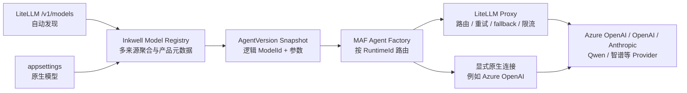

# ADR-026 模型网关：LiteLLM Proxy

## 上下文

Inkwell 需要支持 Azure OpenAI，并为 OpenAI、Anthropic、Qwen、智谱等模型厂商保留接入能力。原设计让 `Inkwell.Core.AgentRuntime` 直接装配各厂商客户端，同时由 Inkwell 配置 Endpoint、Deployment、API Key、重试和降级顺序。该方案会把厂商 SDK、认证方式、限流语义和故障转移逻辑持续引入 Agent Runtime。

[HD-019](../../04-detailed-design/Inkwell.Core/HD-019-Inkwell.Core.Models.md) 已定义配置驱动的模型目录。该目录还承担 UI 模型选择、能力校验、Agent 版本快照和 trace 展示职责，不能由基础设施网关配置直接替代。

## 决策

**Inkwell v1 默认使用自托管 LiteLLM Proxy 作为模型网关，并保留显式配置的原生运行时连接作为例外路径。`IModelRegistryService` 聚合 LiteLLM 自动发现与 appsettings 原生模型；MAF `IAgentFactory` 根据模型的 `RuntimeId` 选择连接器并执行实际调用。**

### Inkwell 保留的模型职责

- `IModelRegistryService` 和多来源只读模型注册表。
- 稳定的逻辑 `ModelId`，例如 `general-fast`、`general-reasoning`。
- `SourceId`（配置来源）、`RuntimeId`（执行连接）与 `RemoteModelId`（远端模型名）三个独立维度。
- Publisher / Family 的标识与显示名称，以及 UI 展示名称、可用状态和不可用原因。
- 模型能力元数据：视觉、工具调用、结构化输出，以及上下文窗口等产品校验所需信息。
- Agent 草稿和已发布版本中的 `AgentModelOptions`，统一承载逻辑 `ModelId` 与模型调用参数。
- 实际逻辑模型、参数、token 用量、网关返回的上游模型标识和错误分类等 trace 字段。

这些信息属于 Inkwell 产品契约。LiteLLM 的配置文件不是客户端 API，也不是 Agent 历史版本的事实源。

### LiteLLM 接管的职责

- 厂商 Endpoint、Deployment 和 API Key。
- LiteLLM `model_name` 到一个或多个上游模型的映射。
- Provider SDK 适配、认证、负载均衡、重试、fallback、限流和预算控制。
- Provider 错误到 OpenAI-compatible 错误响应的归一化。

默认 LiteLLM 路径的厂商凭据只注入 LiteLLM。`Inkwell.WebApi` 和 `Inkwell.Worker` 仅持有 LiteLLM 内部地址及网关访问凭据；只有显式注册原生 Runtime 时，对应进程才持有该原生连接所需的凭据。

### Registry 来源与自动发现

- `ConfigurationModelRegistrySource` 从 `Inkwell:Models` 读取原生模型，显式配置 Publisher、Family、`RuntimeId`、`RemoteModelId`、能力和可用性。
- `LiteLLMModelRegistrySource` 使用带 Bearer 凭据的 `GET /v1/models` 自动发现当前凭据可调用的 LiteLLM `model_name`；v1 不依赖 BETA Management API 或数据库模式。
- LiteLLM 新模型即使没有 Inkwell 元数据也会出现在 Registry 中，但标记为不可用；补齐 Publisher、Family、能力并显式启用后，才允许构建 Agent。
- 所有来源的业务 `ModelId` 在聚合后按大小写不敏感全局唯一；跨来源重名直接失败，不采用隐式覆盖优先级。
- 配置来源和 LiteLLM 业务元数据均在进程启动期校验；列表项 DataAnnotations、空标识和大小写不敏感重复 ID 必须在开始服务请求前失败。
- `GET /api/models` 向已认证客户端返回聚合后的 `ModelDefinition`，不透传 LiteLLM 原始响应或凭据。

### 运行时路由

- 删除 `ModelProviderKind` 封闭枚举；Publisher、Family、Source 与 Runtime 均使用可扩展字符串标识。
- `ModelRoutingAgentFactory` 先通过 Registry 解析业务 `ModelId`，拒绝不可用模型，再按 `RuntimeId` 选择连接器。
- `RuntimeId=litellm` 使用 OpenAI SDK 的自定义 `/v1/` endpoint 创建 Chat Client，并通过 MAF `.AsAIAgent(...)` 执行。
- 配置来源可声明 `RuntimeId=azure-openai` 等显式原生连接。原生连接是特定能力需求的配置选择，不是 LiteLLM 故障时的自动旁路。
- MAF 始终拥有 Agent 执行与模型调用；Registry 只负责发现、元数据、校验和路由选择，不引入负责聊天调用的 `ILLMService`。

LiteLLM `/v1/models` 只承担发现，不单独成为产品事实源：Publisher / Family、中文展示、能力与启用状态仍由 Inkwell 元数据控制；LiteLLM 私有配置形状不得泄漏到 Agent、客户端或持久化契约。

### 版本与路由可追溯性

已发布 Agent 继续保存逻辑 `ModelId`。每次运行的 trace 额外记录：

- Inkwell `ModelId`。
- 解析后的 `SourceId`、`RuntimeId` 与 `RemoteModelId`。
- LiteLLM 返回的实际上游模型标识（可获得时）。
- 模型参数、token 用量、fallback 是否发生和网关请求标识（可获得时）。

v1 不把 LiteLLM 完整路由配置复制进 Agent 快照。运维修改同名路由可能改变后续调用的实际模型，因此路由配置必须版本控制；生产变更需关联发布记录。若未来要求逐次完全重放，再引入不可变路由版本并写入 Agent 快照。

### 部署和故障边界

- 本地开发：ADR-025 Aspire AppHost 增加 LiteLLM 容器，WebApi 和 Worker 等待其健康后启动。
- 生产：同一 Helm release 增加 LiteLLM Deployment/Service；模型厂商 Secret 只挂载到 LiteLLM Pod。
- WebApi 与 Worker 通过集群内部 Service 调用 LiteLLM，不对客户端暴露 LiteLLM；仅持有 LiteLLM 访问凭据。
- LiteLLM 模型不可因网关故障自动改走原生连接；返回结构化模型不可用错误并保留可重试语义。显式配置为原生 Runtime 的模型不受该故障边界约束。
- v1 可先单副本运行，但生产就绪检查必须覆盖健康探针、超时、并发上限、日志脱敏和配置回滚；高可用副本与共享预算存储按压测结果启用。

### 协议验证门禁

正式接入必须通过以下端到端用例：

- 非流式与流式文本响应。
- tool calling 及工具结果回传。
- structured output。
- 图片输入与不支持视觉时的调用前拒绝。
- 客户端取消向上游传播。
- 429、超时、5xx、fallback 和认证失败的错误映射。
- token usage 与实际模型标识进入 trace，且 prompt、API Key 不进入基础设施日志。

## 备选项

### 备选 A：Inkwell 直接接入所有模型厂商

放弃。该方案减少一个网络跳转，但会让 Provider SDK、凭据、重试、fallback 和预算控制进入 Inkwell 核心代码，长期维护成本最高。

### 备选 B：Envoy AI Gateway

暂不采用。其 Kubernetes Gateway API 与流量治理能力更强，但 Inkwell 当前更需要广泛的模型 Provider 适配、模型别名、预算和 fallback。未来若边缘流量治理成为主要矛盾，可在 LiteLLM 前增加 Envoy，或重新评估替换。

### 备选 C：Bifrost

暂不采用。其 Go 实现和性能方向值得持续评估，但当前 Provider 覆盖、社区采用度和运维经验不如 LiteLLM 更符合 v1 风险偏好。通过 OpenAI-compatible 边界保留替换可能。

### 备选 D：直接把 LiteLLM 原始模型列表暴露给客户端

放弃。它会把基础设施路由配置变成产品契约，并丢失 Inkwell 的能力校验、展示和版本语义。

## 后果

### 正面

- 默认模型接入集中在一个 OpenAI-compatible 调用路径，特定能力仍可显式使用原生连接。
- 新增或切换模型厂商主要通过 LiteLLM 配置完成，不需要增加 Inkwell Provider SDK。
- 厂商凭据集中在网关，缩小 WebApi/Worker 的 Secret 暴露面。
- 路由、重试、fallback、限流和预算策略集中治理。
- Inkwell 的模型目录保持稳定，可独立演进产品能力和替换网关。

### 负面

- Agent 调用链增加一个网络跳转和新的关键运行组件。
- LiteLLM 发现结果与 Inkwell 业务元数据存在一致性风险；未补齐元数据的模型会被安全地标记为不可用。
- LiteLLM 的 streaming、tool calling、structured output 和 Provider 差异需要持续做契约测试。
- 同名网关路由被修改后，历史 Agent 的后续执行可能发生变化；v1 依赖配置版本控制与 trace 缓解，尚不具备完全可重放性。

### 中性

- MAF 仍是 Agent 执行引擎；LiteLLM 只替换模型 Provider 接入层，不替代 ADR-003。
- Azure Speech、Embedding Generator 和 Qdrant 不自动纳入本 ADR。Embedding 是否通过 LiteLLM 统一路由需单独验证 `Microsoft.Extensions.AI.IEmbeddingGenerator` 兼容性后决策。
- REQ-005/REQ-006 与 UI 模型选择保持不变，变化发生在后端实现边界。

## 迁移路径

1. 更新 HD-019：将 Catalog 重构为多来源 Registry，删除 `ModelProviderKind`，新增 Publisher / Family / Source / Runtime / RemoteModelId 和能力字段。
2. 在 Aspire AppHost 与 Helm 拓扑加入 LiteLLM，并通过 Secret 注入上游厂商凭据。
3. 将 Agent Factory 改为 Registry 驱动的 Runtime 路由，LiteLLM 为默认连接，原生连接显式注册。
4. 使用 `/v1/models` 自动发现 LiteLLM 模型，对缺失业务元数据的条目实施不可用门禁。
5. 完成协议验证门禁后，删除默认 LiteLLM 路径遗留在 WebApi/Worker 中的厂商凭据；显式原生 Runtime 的凭据与连接代码按配置保留。

## 状态

`proposed`。待 Owner 审阅后人工翻转状态。

## 置信度

`medium`。架构边界明确，但 LiteLLM 与当前 MAF OpenAI/Responses/AG-UI 路径的 streaming、tool calling、structured output 和取消传播尚需端到端验证。
