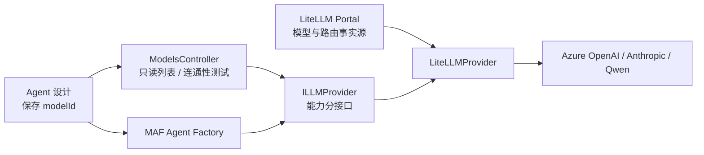

# ADR-026 模型接入端口与 LiteLLM Provider

## 上下文

Inkwell 的模型管理页、Agent 设计页和 Agent 执行都需要使用同一份实时模型信息。模型的 Endpoint、Deployment、API Key、路由、重试、fallback 和预算由 LiteLLM Portal 管理；Inkwell 不应再保存一份模型目录或上游连接配置。

同时，未来可能需要不经过 LiteLLM，直接接入 Azure OpenAI、Anthropic 或 Qwen。业务代码不能依赖某个厂商 SDK，也不能把 Chat、Embedding、图片生成和视频生成强塞进一个只有 Chat 语义的接口。

## 决策

**在 `Inkwell.Abstractions` 定义 `ILLMProvider` 模型发现端口，并按执行能力拆分 `IChatLLMProvider`、`IEmbeddingLLMProvider`、`IImageGenerationLLMProvider` 和 `IVideoGenerationLLMProvider`。v1 只注册 `LiteLLMProvider`；模型列表实时读取 LiteLLM，Agent 仅持久化 `modelId`。**

### 事实源和持久化

- LiteLLM Portal/数据库是 v1 唯一模型与路由事实源。
- Inkwell 不持久化模型目录、能力、Provider、Endpoint、Deployment 或 API Key。
- Agent 草稿和版本只保存 `AgentModelOptions.ModelId` 与调用参数。`modelId` 是对外部模型的引用，不是 Inkwell 模型实体主键。
- 模型被删除或改名后，旧 Agent 执行由 Provider 返回明确错误；不自动切换到其他模型。

### Provider 端口

- `ILLMProvider`：列出当前模型、按 ID 获取模型、测试模型连通性。
- `IChatLLMProvider`：为 Chat 类模型创建 `Microsoft.Extensions.AI.IChatClient`。
- `IEmbeddingLLMProvider`：创建 `IEmbeddingGenerator<string, Embedding<float>>`。
- 图片和视频生成使用独立的请求、结果和异步任务端口；不要求不支持该能力的 Provider 抛 `NotSupportedException`。
- `IAgentFactory` 继续负责 Instructions、Tools、Skills、History 和 MAF `AIAgent` 组装；LLM Provider 不构建 Agent。

每个部署只注册一个 `ILLMProvider`。未来可整体替换为 `AzureOpenAILLMProvider`、`AnthropicLLMProvider` 或 `QwenLLMProvider`；若未来需要同一部署同时直连多个 Provider，应另行设计组合 Provider，不在 v1 预留多来源 Registry。

### 模型分类

公共 `LLMModel` 同时包含：

- `Category`：Inkwell 归一化产品分类，首期支持 `Unknown`、`Chat`、`Embedding`、`ImageGeneration`、`VideoGeneration`。
- `ProviderMode`：Provider 返回的原始开放字符串，未知值不得丢失。
- token 上限和工具、视觉、结构化输出、推理能力；无法确定时使用 `null`，不得误报为 `false`。

LiteLLM mode 映射：

| LiteLLM mode | Inkwell category |
| --- | --- |
| `chat`、`responses`、`completion` | `Chat` |
| `embedding` | `Embedding` |
| `image_generation`、`image_edit` | `ImageGeneration` |
| `video_generation` | `VideoGeneration` |
| 其他或缺失 | `Unknown` |

Vision 是 Chat 模型的输入能力，不等于图片生成类别。Chat Completions 与 Responses 是调用协议，不是模型类别。

### LiteLLM Provider

- `GET /v1/models` 决定当前凭据可访问的模型。
- `GET /model_group/info` 提供 mode、token 上限和聚合能力；按 `model_group` 与模型 ID 合并。
- Provider 原始响应只在适配器内部使用，不向产品 API 泄漏 API Key、Endpoint、deployment Provider 等私有配置。
- v1 Chat 执行返回统一 `IChatClient`。具体使用 Chat Completions 或 Responses 由 `LiteLLMProvider` 内部决定，Agent Factory 不感知协议。
- 模型连通性测试由 Provider 按类别执行低成本检查；视频和图片不默认生成收费内容。

### 2026-07-17 协议验证证据

使用当前 Aspire 运行的 LiteLLM 实例验证：

- `/v1/models` 返回 Portal 模型 `gpt-5.4`，`owned_by=openai`。
- `/model_group/info` 返回 `mode=chat`、`max_input_tokens=1050000`、`max_output_tokens=128000`，工具、视觉和推理能力为 `true`。
- `/v1/chat/completions` 返回 HTTP 200 和预期文本 `chat-ok`。
- `/v1/responses` 返回 HTTP 200、`status=completed` 和预期文本 `responses-ok`。
- 当前 LiteLLM 运行版本的内置模型元数据包含 `chat`、`responses`、`embedding`、`image_generation`、`video_generation` 等 mode；未知 mode 必须保留原值并归类为 `Unknown`。

## 后果

### 正面

- LiteLLM Portal 添加模型后，模型管理页和 Agent 设计页立即看到同一模型，不需要 Inkwell 二次配置。
- 业务层只依赖稳定端口和 `Microsoft.Extensions.AI` 抽象。
- 删除多来源 Registry、metadata 覆盖、`RuntimeId` 路由和原生连接旁路，降低状态不一致风险。
- 模型类别可以服务 Chat Agent、Embedding、图片和视频等不同产品入口。

### 负面

- 更换整个 LLM Provider 时，旧 Agent 的 `modelId` 可能不被新 Provider 识别，需要迁移或保持同名别名。
- 各 Provider 的模型发现能力不完全对称，缺失字段必须允许为 `null`。
- LiteLLM 是 v1 模型调用关键依赖，其不可用会阻断模型列表和执行。

## 不采用方案

### 多来源 Model Registry

不采用。当前产品不需要同时聚合 appsettings 原生模型和 LiteLLM 模型；该设计引入 `SourceId`、`RuntimeId`、`RemoteModelId`、重复 ID 和 metadata 门禁，却没有用户价值。

### 单个巨型 Provider 接口

不采用。Chat、Embedding、图片和视频的同步/异步语义不同，巨型接口会迫使部分 Provider 对不支持的方法抛异常。

### Inkwell 保存 LiteLLM 配置副本

不采用。它会产生双事实源并扩大凭据暴露面。

## 状态

`proposed`。`status` 与 `reviewers` 由 Owner 人工维护。

## 置信度

`high`。模型发现、Chat Completions 和 Responses 已在当前 LiteLLM 实例完成真实验证；Embedding、图片和视频执行端口留到对应功能实施时做端到端验证。
