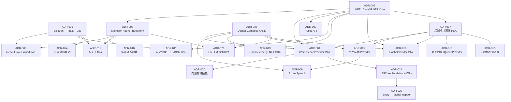

# Inkwell Agent 平台 · ADR 索引

本目录承载 H2 架构选型阶段产出的全部架构决策记录（Architecture Decision Records）。索引规则按 [agents/architect-advisor/AGENT.md §4.4](../../../.he/agents/architect-advisor/AGENT.md)：

- 编号 `ADR-NNN` 一旦发布**不可改**
- 废止只能通过新增 ADR 引用 `superseded-by`
- 状态只允许 `proposed` / `accepted` / `superseded-by:ADR-MMM` / `deprecated`

## 当前 ADR 清单（v1）

<!-- markdownlint-disable MD060 -->

| 编号                                                                              | 标题                                                                                       | 状态     | 主上游                                          | 备注                                                                                                                     |
| --------------------------------------------------------------------------------- | ------------------------------------------------------------------------------------------ | -------- | ----------------------------------------------- | ------------------------------------------------------------------------------------------------------------------------ |
| [ADR-001](./ADR-001-client-runtime-electron-react.md)                             | 客户端运行时：Electron + React + Vite + TypeScript                                         | accepted | OQ-011 / Q-A1                                   | 跨平台桌面壳                                                                                                             |
| [ADR-002](./ADR-002-backend-runtime-dotnet10-aspnetcore.md)                       | 后端运行时：.NET 10 + ASP.NET Core                                                         | accepted | Q-A2                                            | 与 ADR-003 强配套                                                                                                        |
| [ADR-003](./ADR-003-agent-engine-microsoft-agent-framework.md)                    | Agent 执行引擎：Microsoft Agent Framework                                                  | accepted | Q-A3                                            | REQ-007 / REQ-008 / REQ-012 / REQ-014 基础能力                                                                           |
| [ADR-004](./ADR-004-data-store-provider-switchable-ef-core.md)                    | 数据存储：EF Core Provider 可切换 + Qdrant 向量库                                          | accepted | Q-A4 / OQ-A001                                  | 关系层 SQL Server / PostgreSQL 切换（InMemory 已于 2026-07-08 移除）；向量层独立                                         |
| [ADR-005](./ADR-005-deployment-docker-compose-aks.md)                             | 部署形态：dev = Docker Compose / prod = AKS                                                | accepted | Q-A5                                            | Azure 基础设施锁定                                                                                                       |
| [ADR-006](./ADR-006-orchestration-canvas-react-flow.md)                           | ~~编排画布：React Flow + Microsoft Agent Framework Workflows~~（v1 推迟至 v2，2026-07-09） | accepted | OQ-013 / REQ-012                                | UI-006 + Inkwell.Orchestrations 协议（均已推迟）                                                                         |
| [ADR-007](./ADR-007-public-api-token-auth.md)                                     | 公开 API 鉴权：单 Token                                                                    | accepted | REQ-013 / OQ-004                                | UF-010 / EX-005                                                                                                          |
| [ADR-009](./ADR-009-multimodal-azure-speech.md)                                   | 多模态：Azure Speech 后端 ASR + 模型能力清单                                               | accepted | REQ-016 / OQ-003                                | EX-004                                                                                                                   |
| [ADR-010](./ADR-010-skill-loading-static-only-v1.md)                              | Skill 加载：v1 仅静态加载（不预留 Executor 接口）                                          | accepted | REQ-008 / EX-008 / Q-A7                         | UF-006                                                                                                                   |
| [ADR-011](./ADR-011-auto-lock-with-inflight-task-survival.md)                     | 客户端自动锁定 + 在途任务跨锁屏存活                                                        | accepted | NFR-003 / OQ-017 / OQ-A002                      | 与 ADR-012 协同                                                                                                          |
| [ADR-012](./ADR-012-client-server-protocol-rest-agui.md)                          | 客户端↔后端协议：REST + AG-UI Protocol                                                     | accepted | Q-A6 / OQ-A002                                  | Run resume 模式                                                                                                          |
| [ADR-013](./ADR-013-observability-otel-self-hosted-grafana.md)                    | 可观测性：OpenTelemetry + 自托管 Grafana 栈                                                | accepted | Q-A8                                            | trace / log / metric 三件套                                                                                              |
| [ADR-014](./ADR-014-i18n-out-of-scope-v1.md)                                      | 国际化：v1 仅 zh-CN（声明边界）                                                            | accepted | OQ-015                                          | 不引入 i18n 框架                                                                                                         |
| [ADR-015](./ADR-015-object-storage-provider-switchable.md)                        | 文件存储：IFileStorageProvider 可切换（本地 / Azure Blob / MinIO）                         | accepted | OQ-A005 closed §D                               | 与 ADR-004 IPersistenceProvider 同构                                                                                     |
| [ADR-016](./ADR-016-cache-provider-redis.md)                                      | 缓存层：ICacheProvider + Redis 8（单节点 v1）                                              | accepted | OQ-A004 closed §B                               | rate limit / token bucket / hot key                                                                                      |
| [ADR-017](./ADR-017-backend-module-topology-ports-and-adapters.md)                | 后端模块拓扑：Ports & Adapters（3 层 9 csproj + Inkwell.Queue.Redis 共 10）                | accepted | ADR-002 / ADR-003                               | Abstractions · Core · providers/* · Host；MAF 隔离 软边界                                                                |
| [ADR-018](./ADR-018-queue-abstraction-channels-default.md)                        | 后端队列抽象：IQueueProvider + Channels（dev）/ Redis Stream（prod）双 Provider            | accepted | ADR-017 / OQ-A008 closed §B                     | DLQ N=3 24h；queue_depth metric；其他指标进 RISK-014                                                                     |
| [ADR-019](./ADR-019-process-topology-webapi-worker-split.md)                      | 后端进程拓扑：Inkwell.WebApi + Inkwell.Worker 双进程                                       | accepted | ADR-017 / ADR-018                               | csproj 10 → 11；dev Compose 双容器；prod 双 Deployment + 独立 HPA                                                        |
| [ADR-020](./ADR-020-vector-store-microsoft-extensions-vectordata.md)              | 向量存储抽象：复用 Microsoft.Extensions.VectorData + Qdrant / InMemory 双 Provider         | accepted | ADR-004 / ADR-017                               | csproj 11 → 12；providers/Inkwell.VectorStore.Qdrant + Inkwell.Core/InMemoryVectorStore                                  |
| [ADR-021](./ADR-021-efcore-persistence-shared-base-and-provider-csproj-layout.md) | EFCore Persistence 共享层 + 两 Provider 多层 csproj 布局                                   | accepted | ADR-004 / ADR-017                               | csproj 12 → 13 →（2026-07-08）回落 12；providers/Inkwell.Persistence.EFCore base + 2 final adapter（SqlServer/Postgres） |
| [ADR-022](./ADR-022-entity-domain-mapper-selection.md)                            | Entity ↔ Model Mapper 选型：手写扩展方法（`Entity.ToModel()` / `Model.ToEntity()`）        | accepted | ADR-002 / ADR-004 / ADR-017 / ADR-021           | csproj 数不变 13；providers/Inkwell.Persistence.EFCore/Mapping + Repositories；H3 下游在 HD-002 / HD-009                 |
| [ADR-024](./ADR-024-database-migration-seed-standalone-job.md)                    | 数据库 Migration + Seed 执行方式：独立一次性 Migrator 项目/镜像                            | accepted | ADR-004 / ADR-005 / ADR-017 / ADR-019 / ADR-021 | csproj 12 → 13；新增 `Inkwell.Migrator`；取代 ADR-021 「Migration 走裸 CI/CD CLI + Seed 留 WebApi 启动」的现状           |
| [ADR-025](./ADR-025-local-orchestration-aspire.md)                                | 本地开发编排：Aspire AppHost                                                               | draft    | ADR-002 / ADR-005 / ADR-019 / ADR-024           | 仅取代 ADR-005 / ADR-024 的 dev Compose 部分；prod AKS + Helm 不变                                                       |
| [ADR-026](./ADR-026-model-gateway-litellm.md)                                     | 模型网关：LiteLLM Proxy                                                                    | proposed | REQ-005 / REQ-006 / ADR-003 / ADR-025           | 保留 Inkwell 逻辑模型目录；厂商适配、凭据、路由、重试与 fallback 下沉 LiteLLM                                          |

<!-- markdownlint-enable MD060 -->

## ADR 之间的依赖关系

## 维护规则

- 新增 ADR：编号取当前最大 + 1，状态 `proposed` → 评审通过后人工改 `accepted`。
- 废止 ADR：保留原文件不动，新增 ADR 在 `决策` 章节写"supersedes ADR-NNN"，原 ADR 状态改为 `superseded-by:ADR-MMM`。
- 状态只能向前演进（`proposed → accepted → superseded-by | deprecated`），不能回退。
