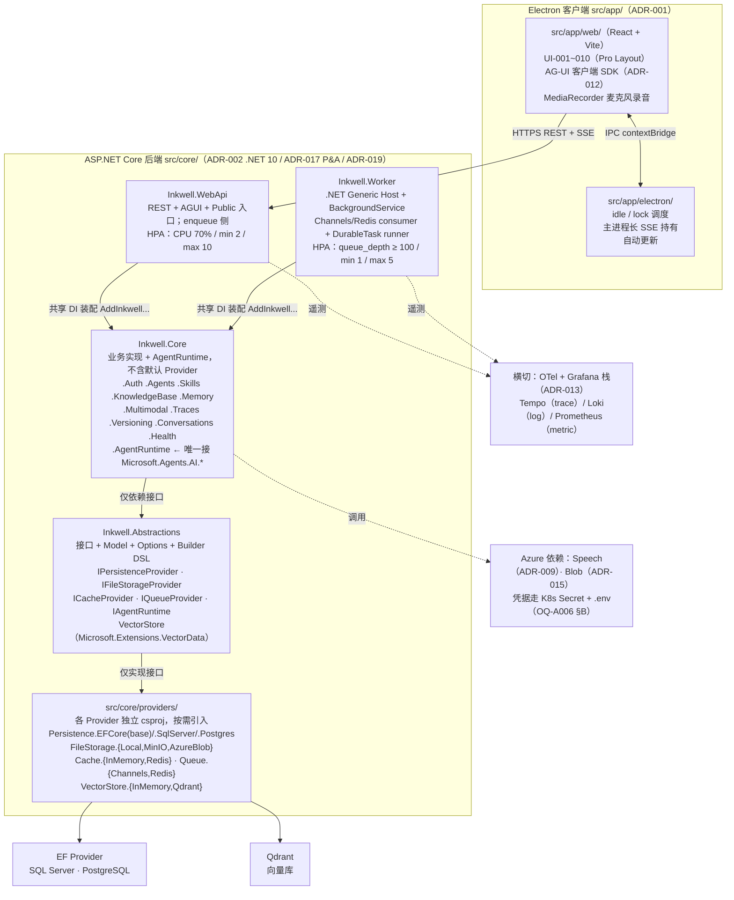

<!-- 2026-05-10 ADR-017 + ADR-018 引入后端模块拓扑重构（capability-folder → Ports & Adapters）+ IQueueProvider 抽象；ADR-019 拆分 Inkwell.WebApi + Inkwell.Worker 双进程；ADR-020 向量存储抽象复用 Microsoft.Extensions.VectorData + Qdrant / InMemory 双 Provider；ADR-021 EFCore Persistence 共享层 + 3 final adapter（2026-07-08 已精化为 2 final adapter，移除 InMemory 关系型 Provider）。本文件 §1 / §3 / §6 / §9 / §14 / §15 已同步更新。
     人工评审动作：确认 status 仍保持 reviewed（incremental update）或翻为 draft 重新过评审，由 Owner 决定。 -->

# Inkwell Agent 平台 · 架构说明

> 本文档对应 [stages.md §5.4](../../../.he/docs/stages.md) 必填章节：总体架构图 / 前端 / 后端 / 数据库 / 缓存 / 消息 / 鉴权 / 文件存储 / 部署 / 可观测性 / 性能目标 / 扩展性 / 安全 / 主要技术风险 / 替代方案比较。详细论证见 [adr/](./adr/) 与 [tech-selection.md](./tech-selection.md) / [risk-analysis.md](./risk-analysis.md)；本文是把它们串成一张架构地图。

## 0. 输入与边界

- **输入**：[REQ-001 ~ REQ-017](../01-requirements/requirements.md) + [NFR-001 ~ NFR-006](../01-requirements/requirements.md) + [UI-001 ~ UI-010](../01-requirements/ui-spec.md) + [UF-001 ~ UF-010](../01-requirements/user-flow.md) + [EX-001 ~ EX-008](../01-requirements/requirements.md) + [repo-impact-map](../01-requirements/repo-impact-map.md) §3 / §6。
- **范围裁剪签字**：[OQ-006 closed §A](../01-requirements/open-questions.md) — v1 范围已固化。
- **不在 v1 范围**：多 region active-passive、客户端离线模式、客户端本地 ASR、TTS、RBAC、多租户隔离、Skill Execution、双语 UI。

## 1. 总体架构图



图说：

- **Ports & Adapters 拓扑**（[ADR-017](./adr/ADR-017-backend-module-topology-ports-and-adapters.md)）：业务代码（`Inkwell.Core` 各业务命名空间）→ 仅依赖 `Inkwell.Abstractions` 中的接口 → `providers/*` 实现接口；不允许业务代码直接 `using` 任何 Provider 包。
- **MAF 隔离边界**：`Inkwell.Core.AgentRuntime` 命名空间是唯一允许 `using Microsoft.Agents.AI.*` 的位置；其他业务命名空间通过 `IAgentRuntime` 接口访问 MAF（[RISK-001](./risk-analysis.md) 缓解手段从 csproj 硬边界降级为 lint + 接口收敛软边界）。

## 2. 前端架构

详见 [ADR-001](./adr/ADR-001-client-runtime-electron-react.md)。

- **Renderer 层**：React 19 + Vite 6 + TypeScript 5.x（最新 minor）；Pro Layout 风格；状态管理使用 [Zustand](https://github.com/pmndrs/zustand)（轻量，避开 Redux 模板代码）+ React Query（数据获取与缓存）。
- **画布层**：~~[React Flow](https://reactflow.dev/)（`@xyflow/react` 12+）+ 自定义 NodeTypes / EdgeTypes（[ADR-006](./adr/ADR-006-orchestration-canvas-react-flow.md)）~~（已随触发器 / 多 Agent 编排于 2026-07-09 推迟至 v2，详见 [requirements.md §13 第 28 条](../01-requirements/requirements.md)；ADR-006 设计保留供 v2 参考）。
- **流式层**：[`@ag-ui/client`](https://github.com/ag-ui-protocol) 客户端 SDK 接收 SSE 事件 → Zustand store → 渲染 [UI-002 聊天](../01-requirements/ui-spec.md) / [UI-007 调试](../01-requirements/ui-spec.md)。
- **Main 层**：负责 idle 监听 / lock 调度（[ADR-011](./adr/ADR-011-auto-lock-with-inflight-task-survival.md)）/ 麦克风权限 / 自动更新（[electron-updater](https://www.electron.build/auto-update)）；通过 `preload.ts` + `contextBridge` 向 Renderer 暴露受控 API。
- **构建**：Vite 单工具链；自动打包 Win / macOS arm64 + macOS x86_64。

## 3. 后端架构

详见 [ADR-002](./adr/ADR-002-backend-runtime-dotnet10-aspnetcore.md) + [ADR-003](./adr/ADR-003-agent-engine-microsoft-agent-framework.md) + [ADR-017](./adr/ADR-017-backend-module-topology-ports-and-adapters.md)（Ports & Adapters 拓扑）。

### 3.1 物理 csproj 拓扑（[ADR-017](./adr/ADR-017-backend-module-topology-ports-and-adapters.md) + [ADR-019](./adr/ADR-019-process-topology-webapi-worker-split.md)）

```text
src/core/
├── Inkwell.Abstractions/        ← 接口 + Model + Options + DI Builder DSL
├── Inkwell.Core/                ← 业务编排域 + AgentRuntime（不含默认 Provider 实现）
├── providers/
│   ├── Inkwell.Persistence.EFCore/                  ← [ADR-021](./adr/ADR-021-efcore-persistence-shared-base-and-provider-csproj-layout.md) 共享 base：Entity / OnModelCreating / EfCorePersistenceProvider / DataSeed
│   ├── Inkwell.Persistence.EFCore.SqlServer/
│   ├── Inkwell.Persistence.EFCore.Postgres/
│   ├── Inkwell.FileStorage.Local/       ← dev / unit test 默认（2026-07-09 从 Inkwell.Core 拆出）
│   ├── Inkwell.FileStorage.MinIO/
│   ├── Inkwell.FileStorage.AzureBlob/
│   ├── Inkwell.Cache.InMemory/          ← dev / unit test 默认（2026-07-09 从 Inkwell.Core 拆出）
│   ├── Inkwell.Cache.Redis/
│   ├── Inkwell.Queue.Channels/          ← dev / unit test 默认（2026-07-09 从 Inkwell.Core 拆出）
│   ├── Inkwell.Queue.Redis/
│   ├── Inkwell.VectorStore.InMemory/    ← dev / unit test 默认（2026-07-09 从 Inkwell.Core 拆出）
│   └── Inkwell.VectorStore.Qdrant/
├── Inkwell.WebApi/              ← ASP.NET Core HTTP / REST / AGUI / Public API 入口（[ADR-019](./adr/ADR-019-process-topology-webapi-worker-split.md) 重命名自 Inkwell.Host）
├── Inkwell.Worker/              ← 队列 consumer + DurableTask runner 入口（[ADR-019](./adr/ADR-019-process-topology-webapi-worker-split.md) 新增）
└── Inkwell.Migrator/            ← 一次性 Migration + Seed 入口（[ADR-024](./adr/ADR-024-database-migration-seed-standalone-job.md) 新增，不常驻）
```

### 3.2 模块说明

- **`Inkwell.Abstractions`**：零外部包依赖（除 `Microsoft.Extensions.*.Abstractions` 与 [`Microsoft.Extensions.VectorData.Abstractions`](https://learn.microsoft.com/dotnet/ai/microsoft-extensions-vector-data)）；包含全部接口（`IPersistenceProvider` / `IFileStorageProvider` / `ICacheProvider` / `IQueueProvider` / `IAgentRuntime`）+ 共享 Model（Result / Error）+ Options + DI Builder DSL（`IInkwellBuilder` 与 `AddInkwell()` 入口）。**向量存储抽象**直接 type-alias 复用 `Microsoft.Extensions.VectorData.VectorStore` / `VectorStoreCollection<TKey, TRecord>`（[ADR-020](./adr/ADR-020-vector-store-microsoft-extensions-vectordata.md)）。
- **`Inkwell.Core`**：业务实现（按 namespace 隔离 Auth / Agents / Skills / KnowledgeBase / Memory / Multimodal / Traces / Versioning / Conversations / Health）+ `Inkwell.Core.AgentRuntime` 命名空间（唯一允许 `using Microsoft.Agents.AI.*` 的位置，封装 [`Microsoft.Agents.AI`](../../../microsoft/agent-framework/dotnet/src/Microsoft.Agents.AI/) / [`.AGUI`](../../../microsoft/agent-framework/dotnet/src/Microsoft.Agents.AI.AGUI/) / [`.Workflows`](../../../microsoft/agent-framework/dotnet/src/Microsoft.Agents.AI.Workflows/) / [`.DurableTask`](../../../microsoft/agent-framework/dotnet/src/Microsoft.Agents.AI.DurableTask/) 公共 API，对外暴露 `IAgentRuntime`）；不含任何 Provider 默认实现（已拆到 `providers/*`，与 SDK-bound 实现对称）。
- **`providers/*`**：12 个 Provider 实现（含 1 个 EFCore family 共享 base + 2 EFCore final adapter + 4 个 dev 默认实现 + 5 个 SDK-bound 实现），每个独立 csproj；只依赖 `Inkwell.Abstractions`，**不依赖** `Inkwell.Core`（避免循环 + 让 Provider 可独立分发）。**EFCore family 例外**（[ADR-021](./adr/ADR-021-efcore-persistence-shared-base-and-provider-csproj-layout.md)）：SqlServer / Postgres 两 final adapter 允许引用同位 `providers/Inkwell.Persistence.EFCore` base csproj（shared adapter base + final adapter 分层）。每个 final adapter Provider 提供对应的 `IInkwellBuilder` extension method（`UseSqlServer()` / `UsePostgres()` / `UseLocalFileSystemFileStorage()` / `UseMinIOFileStorage()` / `UseAzureBlobFileStorage()` / `UseInMemoryCache()` / `UseRedisCache()` / `UseChannelsQueue()` / `UseRedisQueue()` / `UseInMemoryVectorStore()` / `UseQdrantVectorStore()` 等）。
- **`Inkwell.WebApi`**（[ADR-019](./adr/ADR-019-process-topology-webapi-worker-split.md)）：ASP.NET Core HTTP / REST / AGUI SSE / Public API 入口。`Microsoft.NET.Sdk.Web`。`Program.cs` 调用 `AddInkwell()...Build()`，然后 `MapInkwellEndpoints()`。**仅注册 IQueueProvider enqueue 侧**，不跑 consumer。HPA：CPU 70%，min 2 / max 10。
- **`Inkwell.Worker`**（[ADR-019](./adr/ADR-019-process-topology-webapi-worker-split.md)）：队列 consumer + [`Microsoft.Agents.AI.DurableTask`](../../../microsoft/agent-framework/dotnet/src/Microsoft.Agents.AI.DurableTask/) runner + 后台慢任务入口。`Microsoft.NET.Sdk.Worker`（[.NET Generic Host](https://learn.microsoft.com/aspnet/core/fundamentals/host/generic-host) + [`BackgroundService`](https://learn.microsoft.com/aspnet/core/fundamentals/host/hosted-services)）。`Program.cs` 调用 `AddInkwell()...Build()` + `AddInkwellWorker()`。不开 HTTP 业务端口（仅开 `/healthz` probe + Prometheus scrape `/metrics`）。HPA：自定义 metric `queue_depth` ≥ 100，min 1 / max 5，fallback CPU 70%。

### 3.3 数据访问

- 使用 EF Core Code First + EF Migration（SqlServer / Postgres 各一份 `Migrations/` 位于各自 final adapter csproj，[ADR-021](./adr/ADR-021-efcore-persistence-shared-base-and-provider-csproj-layout.md)；CI 跑两套 — [RISK-002](./risk-analysis.md)）。本地开发与单元 / 集成测试通过 [Testcontainers](https://testcontainers.com/) 起真实 SqlServer / Postgres 实例（不再使用 InMemory Provider，[ADR-004 2026-07-08 更新](./adr/ADR-004-data-store-provider-switchable-ef-core.md)：`Microsoft.EntityFrameworkCore.InMemory` 不支持外键约束，对本地开发价值有限）。
- `IPersistenceProvider` 抽象位于 `Inkwell.Abstractions`；唯一实现 `EfCorePersistenceProvider` 位于 `providers/Inkwell.Persistence.EFCore/`（[ADR-021](./adr/ADR-021-efcore-persistence-shared-base-and-provider-csproj-layout.md)）；两 final adapter csproj 仅提供 `DbContextOptionsBuilder.UseXxx` 与 Builder DSL 扩展方法，**不重复实现** `IPersistenceProvider`。业务实体（`Agent` / `Conversation` / `Run` / `Trace` / `KnowledgeBase` / `MemoryItem` / `Skill` / `Tool` / `Version` / `User` 等）集中在 `Inkwell.Persistence.EFCore/Entities/`。
- **DataSeed** 通过 Builder DSL `.AutoSeedOnStartup(true|false)` 控制（default true），[`Inkwell.WebApi` 启动时](./adr/ADR-019-process-topology-webapi-worker-split.md) 由 `MigrationRunner` 在 Migration 完成后调 `InkwellSeeder.SeedAsync()`；Worker 不跑 Migration / Seed（避免双跡）。Seed 内容必须幂等（按业务唯一键判定而非 Id）。
- **向量存储**（[ADR-020](./adr/ADR-020-vector-store-microsoft-extensions-vectordata.md)）：复用 [`Microsoft.Extensions.VectorData`](https://learn.microsoft.com/dotnet/ai/microsoft-extensions-vector-data) 抽象（`VectorStore` / `VectorStoreCollection<TKey, TRecord>` + `[VectorStoreKey]` / `[VectorStoreData]` / `[VectorStoreVector]` attribute model）；prod 走 `providers/Inkwell.VectorStore.Qdrant/`，dev / unit test 走 `providers/Inkwell.VectorStore.InMemory/`；KB / Memory 业务语义（chunking / retention）在各自 Service 层包，**不**进 `Inkwell.Abstractions`。embedding 生成通过 [`Microsoft.Extensions.AI.IEmbeddingGenerator`](https://learn.microsoft.com/dotnet/api/microsoft.extensions.ai.iembeddinggenerator-2)（Builder DSL `UseAzureOpenAIEmbeddings(...)`）解耦。

> **2026-07-06 errata（同步 [ADR-021 2026-07-06 errata](./adr/ADR-021-efcore-persistence-shared-base-and-provider-csproj-layout.md)）**：上方「DataSeed」一条中「[`Inkwell.WebApi` 启动时](./adr/ADR-019-process-topology-webapi-worker-split.md) 由 `MigrationRunner` 在 Migration 完成后调 `InkwellSeeder.SeedAsync()`」的表述已被修订——**Migration 不再随 `Inkwell.WebApi` 启动自动执行**，改由 CI/CD pipeline（GitHub Actions）独立步骤在部署前完成；`MigrationRunner` 在 `Inkwell.WebApi` 启动时仅负责（在确认 schema 已就绪的前提下）触发 `InkwellSeeder.SeedAsync()`，不再调用 `Database.MigrateAsync()`。触发原因：H3 HD-011 起草期发现的生产安全考量，Owner 拍板；详见 [ADR-021 §「Migration / DataSeed 启动行为」errata](./adr/ADR-021-efcore-persistence-shared-base-and-provider-csproj-layout.md)。
>
> **2026-07-09 errata（[ADR-024](./adr/ADR-024-database-migration-seed-standalone-job.md) 取代上方两条）**：上方「DataSeed」一条本身、以及 2026-07-06 errata 描述的「Migration 走 CI/CD 裸 CLI」，均已被 [ADR-024](./adr/ADR-024-database-migration-seed-standalone-job.md) 取代。新状态：Migration **与** Seed 合并进独立一次性 `Inkwell.Migrator` 入口（dev Compose 一次性 service + `depends_on.condition: service_completed_successfully`；prod Helm `pre-install,pre-upgrade` hook Job），`Inkwell.WebApi` 启动代码不再调用 `MigrationRunner` 的任何分支。触发原因：risk-analysis.md 已记录的 Seed 多副本竞态风险 + Microsoft EF Core 官方文档不建议应用运行时执行 Migration；Owner picker 拍板确认。

### 3.4 Builder DSL（[ADR-019](./adr/ADR-019-process-topology-webapi-worker-split.md) 双进程增量）

```csharp
// Inkwell.WebApi/Program.cs
var builder = WebApplication.CreateBuilder(args);
builder.Services.AddInkwell()
    .UseSqlServer(builder.Configuration.GetConnectionString("Inkwell"))
    .UseAzureBlob(opts => builder.Configuration.GetSection("Inkwell:FileStorage:Azure").Bind(opts))
    .UseRedis(builder.Configuration.GetConnectionString("Redis"))
    .UseRedisQueue(builder.Configuration.GetConnectionString("RedisQueue")) // enqueue side
    .Build();
var app = builder.Build();
app.MapInkwellEndpoints();
app.Run();

// Inkwell.Worker/Program.cs
var builder = Host.CreateApplicationBuilder(args);
builder.Services.AddInkwell()
    .UseSqlServer(...)
    .UseAzureBlob(...)
    .UseRedis(...)
    .UseRedisQueue(...)         // consume side
    .Build();
builder.Services.AddInkwellWorker(); // BackgroundService 注册集
var host = builder.Build();
host.Run();
```

未引用的 Provider csproj 对应的 `Use*()` extension method 不可见，天然裁剪。WebApi / Worker / Migrator 必须使用同一 image tag，Migrator 以 Helm hook Job / Compose 一次性 service 形态运行且必须先于 WebApi / Worker 完成（[ADR-024](./adr/ADR-024-database-migration-seed-standalone-job.md)），避免 [RISK-015](./risk-analysis.md) 版本漂移。

## 4. 数据库选型

详见 [ADR-004](./adr/ADR-004-data-store-provider-switchable-ef-core.md)。

> **2026-05-10 errata（F1 + F9）**——源 [`design-review-report.md` §6.4](../04-detailed-design/design-review-report.md)
>
> - 本节中 `appsettings.json` 配置键 `Inkwell:DataStore:Provider` 字面量已被精化：H3 [HD-002 §3.5](../04-detailed-design/Inkwell.Abstractions/HD-002-Inkwell.Abstractions-persistence-port.md) 首先改名为 `Inkwell:Persistence:Provider`；
> - 2026-05-10 InkwellOptions 形态 C 拍板（[`design-review-report.md` §6.4.1 F9](../04-detailed-design/design-review-report.md)）进一步把 Provider 选择器**集中**到顶层 `Inkwell:Providers` 段——最终配置键为 `Inkwell:Providers:Persistence`，由 [`InkwellProvidersOptions`](../04-detailed-design/Inkwell.Abstractions/HD-001-Inkwell.Abstractions-foundation.md) 承载，与 `Queue` / `Cache` / `FileStorage` / `VectorStore` / `AgentRuntime` 同段集中；
> - `Inkwell:Persistence:*` 仍承载 ConnectionString / 超时 / Seed / SensitiveLogging 等详细配置不变；
> - Builder DSL `.UseSqlServer(...)` / `.UsePostgres(...)` 装配期会与 `Inkwell:Providers:Persistence` 取值交叉校验，不一致或重复注册抛 `INK-CORE-006 ProviderRegistrationConflict`（[HD-001 §3.13](../04-detailed-design/Inkwell.Abstractions/HD-001-Inkwell.Abstractions-foundation.md)）。
>
> H2 主决策（EF Core 10 + 三 Provider 切换 + Code First + Migration）不变；本 errata 仅声明配置键命名精化，便于 H3 / H5 引用时不踩字面量陷阱。

- **关系数据**：EF Core 10（与 .NET 10 同步发布）+ Provider 切换（SQL Server 2025 / PostgreSQL 17），通过 `appsettings.json` 的 `Inkwell:Providers:Persistence` 字段选择（精化历史见上方 errata）。
- **向量数据**：[Qdrant 1.x](https://qdrant.tech/)，gRPC SDK，封装在 `Inkwell.DataAccess.VectorStore`。
- **关键表**：
  - `agents` / `agent_versions`（[REQ-002](../01-requirements/requirements.md)）
  - `skills`（[ADR-010](./adr/ADR-010-skill-loading-static-only-v1.md)）
  - `knowledge_bases` / `kb_documents` / `kb_chunks`（[REQ-009](../01-requirements/requirements.md)）
  - `conversations` / `messages`（[REQ-006](../01-requirements/requirements.md) + [NFR-005](../01-requirements/requirements.md)）
  - `agui_run_events`（[ADR-011](./adr/ADR-011-auto-lock-with-inflight-task-survival.md) + [ADR-012](./adr/ADR-012-client-server-protocol-rest-agui.md)）
  - `public_api_tokens`（[ADR-007](./adr/ADR-007-public-api-token-auth.md)）

  > `orchestration_graphs` / `orchestration_runs`（REQ-012）已于 2026-07-09 随多 Agent 编排功能推迟至 v2，不在 v1 创建，详见 [requirements.md §13 第 28 条](../01-requirements/requirements.md)。
- **Migration**：每 Provider 一份 `Migrations/<Provider>/`；CI 跑两套（[RISK-002](./risk-analysis.md)）。

## 5. 缓存策略

详见 [ADR-016 ICacheProvider + Redis](./adr/ADR-016-cache-provider-redis.md)。

- **抽象**：后端业务代码仅依赖 [`Inkwell.Cache.ICacheProvider`](../01-requirements/repo-impact-map.md)（Get / Set / Remove / Exists / Increment / TryAcquireLock）；不直接 `using StackExchange.Redis`。
- **实现**：v1 仅 `RedisCacheProvider`（[StackExchange.Redis](https://stackexchange.github.io/StackExchange.Redis/)，`providers/Inkwell.Cache.Redis/`）；`InMemoryCacheProvider`（`providers/Inkwell.Cache.InMemory/`）仅用于 dev / 单元测试。
- **部署**：dev = 本机 [redis:8](https://hub.docker.com/_/redis) 容器 / prod = [Azure Cache for Redis](https://learn.microsoft.com/azure/azure-cache-for-redis/) Standard 或 Premium tier / 自建场景 = `redis` StatefulSet + PVC。
- **使用场景**：
  - **Public API rate limit**（[ADR-007](./adr/ADR-007-public-api-token-auth.md)）：[`Microsoft.AspNetCore.RateLimiting`](https://learn.microsoft.com/aspnet/core/performance/rate-limit) middleware 后端接 Redis token bucket，在 HPA min 2 副本场景下仍保证“租户 60 req/min”语义一致。
  - **Agent 会话短期状态**：`AgentThread` 当前对话窗口的最近 N 条消息缓存，避免每次 Run 调用 [`IPersistenceProvider`](./adr/ADR-004-data-store-provider-switchable-ef-core.md)。
  - **元数据缓存**：Skill registry / Agent 配置 / 模型 Provider 列表（TTL 5 min）。
  - **模型 response cache**：默认关闭，H3 详细设计明确“安全可缓存的模型调用集合”后再启用。
- **限流**：[`PartitionedRateLimiter`](https://learn.microsoft.com/dotnet/api/system.threading.ratelimiting.partitionedratelimiter) 后端从内存 token bucket 切换为 Redis 分布式 token bucket。
- **Key 命名约定**：`{tenant}:{module}:{purpose}:{id}`。
- **不在 v1 范围**：Redis Cluster / Sentinel HA / Lua 脚本式分布式锁（v1 用 `SET NX EX` 简单锁）。

## 6. 消息机制

- **客户端↔后端**：REST + AG-UI Protocol over SSE（[ADR-012](./adr/ADR-012-client-server-protocol-rest-agui.md)）；不持久化 AG-UI 事件流，跨锁屏体验由客户端主进程长 SSE 保证（[ADR-011](./adr/ADR-011-auto-lock-with-inflight-task-survival.md)）。
- **后端内队列抽象**：[`IQueueProvider`](./adr/ADR-018-queue-abstraction-channels-default.md) 接口位于 `Inkwell.Abstractions`。环境对称双 Provider（与 [`IPersistenceProvider`](./adr/ADR-004-data-store-provider-switchable-ef-core.md) / [`ICacheProvider`](./adr/ADR-016-cache-provider-redis.md) / [`IFileStorageProvider`](./adr/ADR-015-object-storage-provider-switchable.md) 拓扑对齐）：
  - **dev / unit test**：`ChannelsQueueProvider`（基于 [`System.Threading.Channels`](https://learn.microsoft.com/dotnet/core/extensions/channels)，in-process、不持久）位于 `Inkwell.Core`，`AddInkwell()` 默认注入。
  - **integration test / prod**：`RedisStreamQueueProvider`（基于 [Redis 8 Streams](https://redis.io/docs/latest/develop/data-types/streams/) consumer group）位于 `providers/Inkwell.Queue.Redis`（[ADR-017](./adr/ADR-017-backend-module-topology-ports-and-adapters.md) / [OQ-A008 closed §B](./open-questions-arch.md)）。**Consumer 跑在 `Inkwell.Worker` 进程**（[ADR-019](./adr/ADR-019-process-topology-webapi-worker-split.md)）：`Inkwell.WebApi` 仅注册 enqueue 侧，Worker Pod 独立扩缩（HPA 基于 `queue_depth`）。锁定设计：DLQ N=3 + 24h 保留；fairness / crash recovery / retry 依赖 Redis Streams 内置语义（[`XREADGROUP`](https://redis.io/docs/latest/commands/xreadgroup/) consumer group + [`XCLAIM`](https://redis.io/docs/latest/commands/xclaim/) visibility timeout = 5 min + 指数退避 1s/max 60s）；observability v1 必发 `queue_depth`，其余五项进 [RISK-014](./risk-analysis.md) “prod 上线前补齐”残余风险。
  - **DI 切换**：`AddInkwell().UseRedisQueue(connectionString)` 插入后覆盖 Channels。业务代码仅认 `IQueueProvider`，不直接依赖 `System.Threading.Channels` / `StackExchange.Redis`。
- **分布式队列实现**：`providers/Inkwell.Queue.Redis/` v1 同期出 csproj（[OQ-A008 closed §B](./open-questions-arch.md) + [ADR-018](./adr/ADR-018-queue-abstraction-channels-default.md)），环境对称原则：dev = `ChannelsQueueProvider`（in-process） / integration test + prod = `RedisStreamQueueProvider`（跨副本、DLQ N=3 + 24h、Redis Streams 内置 fairness / crash recovery / retry 语义）。与 [Inkwell.Cache.Redis](./adr/ADR-016-cache-provider-redis.md) Redis 实例是复用还是独立部署，由 H3 [Inkwell.Queue.Redis](./adr/ADR-017-backend-module-topology-ports-and-adapters.md) HD 决（建议独立）。
- **后端持久工作流**：[`Microsoft.Agents.AI.DurableTask`](../../../microsoft/agent-framework/dotnet/src/Microsoft.Agents.AI.DurableTask/)（[ADR-003](./adr/ADR-003-agent-engine-microsoft-agent-framework.md)）；跨 Pod 重启续作。覆盖 KB ingest（[REQ-009](../01-requirements/requirements.md)） / 后台慢任务两大主异步场景，**与 `IQueueProvider` 协同非互斥**（原"Trigger fan-out"场景随 REQ-011 于 2026-07-09 推迟至 v2，详见 [requirements.md §13 第 28 条](../01-requirements/requirements.md)；[ADR-006](./adr/ADR-006-orchestration-canvas-react-flow.md) 编排 DAG 执行同样推迟）。
- **v1 不引入消息队列外部中间件**（RabbitMQ / Azure Service Bus）：`IQueueProvider` 接口 + `ChannelsQueueProvider`（dev） + `RedisStreamQueueProvider`（integration / prod）是与三 Provider 家族同构的环境对称 Provider，不被视为“外部中间件”（详见 [ADR-018](./adr/ADR-018-queue-abstraction-channels-default.md)）。

## 7. 鉴权与权限模型

- **客户端会话**：v1 单用户 + 启动时密码登录 + cookie session（[NFR-003](../01-requirements/requirements.md) 锁屏共用同一会话）。
- **公开 API**：单 Token + Bearer scheme（[ADR-007](./adr/ADR-007-public-api-token-auth.md)）；Rate limit token bucket 在 [`ICacheProvider`](./adr/ADR-016-cache-provider-redis.md) 上分布式均平。
- **凭据保护**：Azure Speech / Azure OpenAI / SMTP / Redis / DB 等凭据都走 [Kubernetes Secret](https://kubernetes.io/docs/concepts/configuration/secret/)（prod）/ [Docker Compose `.env`](https://docs.docker.com/compose/environment-variables/set-environment-variables/)（dev）（[OQ-A006 closed §B](./open-questions-arch.md)）；**v1 不引入 Azure Key Vault**，该决策的残余风险走 [RISK-013](./risk-analysis.md)。
- **不在 v1 范围**：RBAC / 多租户 / OAuth2 / SSO。

## 8. 文件存储方案

详见 [ADR-015](./adr/ADR-015-object-storage-provider-switchable.md) + [OQ-A005 closed §D](./open-questions-arch.md)。

- **抽象**：后端接口 [`IFileStorageProvider`](../01-requirements/repo-impact-map.md)（Upload / Download / Delete / Exists / CreatePresignedUploadUrl / CreatePresignedDownloadUrl / List），业务代码只依赖接口。
- **三 Provider 切换**（与 [ADR-004 IPersistenceProvider](./adr/ADR-004-data-store-provider-switchable-ef-core.md) + [ADR-016 ICacheProvider](./adr/ADR-016-cache-provider-redis.md) 同构）：
  - **`LocalFileSystem`**：写本地磁盘（`./data/objects/`），预签名由后端中转模拟。适用：单元测试 / 单体部署 / 离线场景。
  - **`AzureBlob`**：[Azure Blob Storage](https://learn.microsoft.com/azure/storage/blobs/) + [SAS URL](https://learn.microsoft.com/azure/storage/common/storage-sas-overview)。适用：Azure 客户的 prod 环境；dev 可选接 [Azurite emulator](https://learn.microsoft.com/azure/storage/common/storage-use-azurite)。
  - **`MinIO`**：[MinIO](https://min.io/)（S3 兼容） + S3 预签名 URL。适用：dev 默认 / 自建 K8s prod / 不入 Azure 的客户。
- **启动选择**：`appsettings.json` 的 `Inkwell:FileStorage:Provider` 字段（`LocalFileSystem` / `AzureBlob` / `MinIO`）；Helm values 在 prod 切换。
- **容器命名**：`uploads/` / `kb-source/` / `kb-extracted/`。在 `MinIO` 上映射为 bucket；在 `LocalFileSystem` 上为子目录。
- **客户端上传**：三 Provider 都是"后端发预签名 URL → 客户端直传"模式，客户端代码零差异。
- **多模态文件**（[ADR-009](./adr/ADR-009-multimodal-azure-speech.md)）：上传后后端生成预签名下载 URL 作为多模态消息的 image_url / file 元素传给 Azure OpenAI（仅当模型支持 vision）。

## 9. 部署方式

详见 [ADR-005](./adr/ADR-005-deployment-docker-compose-aks.md)。

### 9.1 dev 部署（Docker Compose）

```text
docker compose up -d
  ├─ webapi          (Inkwell.WebApi：REST + AGUI + Public)
  ├─ worker          (Inkwell.Worker：RedisStream consumer + DurableTask runner; ADR-019)
  ├─ postgres        (PostgreSQL 17, named volume)
  ├─ qdrant          (Qdrant 1.x, named volume)
  ├─ redis           (Redis 8，ICacheProvider + IQueueProvider 后端, ADR-016 + ADR-018)
  ├─ minio           (S3 兼容文件存储 dev 默认 Provider, ADR-015)
  ├─ otel-collector  (OTLP receiver 双 source: webapi + worker, ADR-013)
  ├─ tempo
  ├─ loki
  ├─ prometheus
  └─ grafana         (默认 dashboard 已加载)
```

### 9.2 prod 部署（AKS + Helm）

```text
helm install inkwell ./charts/inkwell --namespace inkwell-prod
  ├─ Deployment: inkwell-webapi (HPA: CPU 70%, min 2, max 10)
  ├─ Deployment: inkwell-worker (HPA: queue_depth≥100, min 1, max 5；ADR-019)
  ├─ Job (hook: pre-install,pre-upgrade): inkwell-migrator (一次性 Migration + Seed；ADR-024)
  ├─ StatefulSet: postgres (Azure Disk Premium, 100GiB)
  ├─ StatefulSet: qdrant (Azure Disk Premium, 50GiB)
  ├─ Cache: Azure Cache for Redis Standard (默认) 或 StatefulSet: redis (自建场景, ADR-016)
  ├─ FileStorage: AzureBlob (默认) 或 StatefulSet: minio (自建场景, ADR-015)
  ├─ Deployment: otel-collector (双 source: webapi + worker, ADR-013)
  ├─ Stack (Helm subchart): grafana / tempo / loki / prometheus
  ├─ Ingress: NGINX + cert-manager (Let's Encrypt) — 仅 webapi
  └─ Secrets: Kubernetes Secret + RBAC + at-rest 加密（OQ-A006 §B，未引入 Key Vault，残余风险 RISK-013）
```

> webapi 、 worker 与 migrator **必须使用同一 image tag**，单 Helm release 同时滚（[ADR-019](./adr/ADR-019-process-topology-webapi-worker-split.md) / [ADR-024](./adr/ADR-024-database-migration-seed-standalone-job.md) / [RISK-015](./risk-analysis.md)）。`entrypoint`：image 内置三份，Helm 通过 `command:` / `args:` 区分（`dotnet Inkwell.WebApi.dll` vs `dotnet Inkwell.Worker.dll` vs `dotnet Inkwell.Migrator.dll`）。migrator 以 hook Job 形态跑完即退，不常驻。

- **CI/CD**：GitHub Actions（[OQ-A007 closed §A](./open-questions-arch.md)）→ build → ACR push → Helm deploy。后端仓库走 [MSTest.Sdk 4.x](https://github.com/microsoft/testfx)（最新稳定 4.2.2，默认使用 [Microsoft.Testing.Platform](https://learn.microsoft.com/dotnet/core/testing/unit-testing-platform-intro) / MTP runner）；前端 Vitest；E2E Playwright。
- **region**：v1 单 region；多 region 列入 v2（[RISK-004](./risk-analysis.md)）。

## 10. 可观测性方案

详见 [ADR-013](./adr/ADR-013-observability-otel-self-hosted-grafana.md)。

- **三件套**：Trace (Tempo) / Log (Loki) / Metric (Prometheus) → Grafana 统一 UI。
- **应用 instrumentation**：[OpenTelemetry .NET SDK](https://opentelemetry.io/docs/languages/dotnet/) + MAF 内置 instrumentation（覆盖 LLM / 工具调用 / Skill / Workflow 节点）。
- **关键指标**：
  - `inkwell_runs_total` / `_errors_total`（Run 数与错误率）
  - `inkwell_run_duration_seconds`（P50 / P95 / P99）
  - `inkwell_tool_calls_total`（按 tool_id label）
  - `inkwell_skill_activations_total`（按 skill_id label）
- **告警**：Grafana Alerting → SMTP（v1 唯一通道）；月度调用量阈值告警（[RISK-005](./risk-analysis.md)）。
- **业务 trace UI**：[UI-007 调试页](../01-requirements/ui-spec.md) 直接查 Tempo（自建 UI），与 Grafana ops Dashboard 分离。

## 11. 性能目标

> [OQ-002 closed §B](../01-requirements/open-questions.md) 已锁"v1 仅给软目标，不强承诺 SLA"。下表是工程指引，不是合同。

| 维度                 | 软目标（P95） | 备注                      |
| -------------------- | ------------- | ------------------------- |
| REST CRUD 响应       | < 300 ms      | 单租户场景                |
| AG-UI 流式首字符     | < 1.5 s       | 受模型主导                |
| 语音 ASR 首字符      | < 500 ms      | Azure Speech 流式         |
| 知识库 RAG 检索      | < 200 ms      | Qdrant gRPC               |
| 缓存读 / 写（Redis） | < 5 ms        | 同 VPC / Private Endpoint |

## 12. 扩展性设计

- **横向扩展**：API Deployment 通过 HPA 自动伸缩；DurableTask actor placement 保证 Run 在 Pod 替换时不丢（[ADR-011](./adr/ADR-011-auto-lock-with-inflight-task-survival.md)）。
- **数据扩展**：PostgreSQL StatefulSet 单实例；v2 评估读副本 / Citus 分片。
- **向量扩展**：Qdrant StatefulSet 单实例；v2 评估 [Qdrant cluster](https://qdrant.tech/documentation/guides/distributed_deployment/)。
- **可观测性扩展**：OTel Collector 可水平扩展；Loki / Tempo / Prometheus 启用 [Object Storage backend](https://grafana.com/docs/loki/latest/operations/storage/)（[RISK-006](./risk-analysis.md) 缓解 #2）。
- **文件存储扩展**（[ADR-015](./adr/ADR-015-object-storage-provider-switchable.md)）：`AzureBlob` 天然水平扩展；`MinIO` v2 可平滑升级为 [分布式部署](https://min.io/docs/minio/linux/operations/install-deploy-manage/deploy-minio-multi-node-multi-drive.html)；`LocalFileSystem` 仅推荐单实例 / 测试场景。
- **缓存扩展**（[ADR-016](./adr/ADR-016-cache-provider-redis.md)）：prod 走 Azure Cache for Redis Standard 两节点复制 / Premium cluster；自建场景 v1 单节点 + PVC，v2 评估 Redis Sentinel / Cluster。
- **模型扩展**（[REQ-005](../01-requirements/requirements.md)）：通过 MAF `IChatClient` 接口接入 Azure OpenAI / OpenAI / Anthropic / Qwen / 智谱（v1 真接 Azure OpenAI，其他 v2）。

## 13. 安全设计

详见 [NFR-006](../01-requirements/requirements.md) 与 [ADR-007](./adr/ADR-007-public-api-token-auth.md) / [ADR-009](./adr/ADR-009-multimodal-azure-speech.md) / [ADR-010](./adr/ADR-010-skill-loading-static-only-v1.md) / [ADR-011](./adr/ADR-011-auto-lock-with-inflight-task-survival.md) / [ADR-016](./adr/ADR-016-cache-provider-redis.md)。

- **传输加密**：HTTPS / TLS 1.3（[NGINX Ingress + cert-manager](https://learn.microsoft.com/azure/aks/app-routing)）。
- **凭据管理**（[OQ-A006 closed §B](./open-questions-arch.md)）：prod 走 [Kubernetes Secret](https://kubernetes.io/docs/concepts/configuration/secret/) + [静态加密](https://kubernetes.io/docs/tasks/administer-cluster/encrypt-data/) + RBAC；dev 走 [Docker Compose `.env`](https://docs.docker.com/compose/environment-variables/set-environment-variables/)（`.gitignore` 收敛）；Token / Skill 文件等敏感字段哈希存储。**v1 不引入 Azure Key Vault**，详见 [RISK-013](./risk-analysis.md)。
- **客户端锁屏**：5 min idle 自动锁定；主进程背后保持 SSE 订阅（[ADR-011](./adr/ADR-011-auto-lock-with-inflight-task-survival.md)）。
- **Skill 执行边界**：v1 不执行任何脚本（[ADR-010](./adr/ADR-010-skill-loading-static-only-v1.md)）。
- **公开 API 限流**：60 req/min 默认（[ADR-007](./adr/ADR-007-public-api-token-auth.md)）；走 [`ICacheProvider`](./adr/ADR-016-cache-provider-redis.md) 后端保证多副本下额度一致。
- **客户端 IPC 隔离**：Electron `contextIsolation: true` + `nodeIntegration: false`（[ADR-001](./adr/ADR-001-client-runtime-electron-react.md)）。

## 14. 主要技术风险

详见 [risk-analysis.md](./risk-analysis.md)。RISK-NNN 摘要：

- [RISK-001](./risk-analysis.md#risk-001-microsoft-agent-framework-成熟度) Microsoft Agent Framework 成熟度（[ADR-017](./adr/ADR-017-backend-module-topology-ports-and-adapters.md) 缓解手段从 csproj 硬边界降级为 lint + 接口收敛软边界）
- [RISK-002](./risk-analysis.md#risk-002-ipersistenceprovider-切换抽象漏出) IPersistenceProvider 切换抽象漏出
- [RISK-003](./risk-analysis.md#risk-003-nfr-003-字面与-oq-017-文字差异-w-003) NFR-003 字面与 OQ-017 文字差异（W-003）
- [RISK-004](./risk-analysis.md#risk-004-aks-单-region-可用性) AKS 单 region 可用性
- [RISK-005](./risk-analysis.md#risk-005-azure-speech-依赖--成本) Azure Speech 依赖 / 成本
- [RISK-006](./risk-analysis.md#risk-006-自托管-grafana-栈数据保留--运维) 自托管 Grafana 栈数据保留 / 运维
- [RISK-007](./risk-analysis.md#risk-007-主进程长-sse-跨锁屏可靠性) 主进程长 SSE 跨锁屏可靠性
- [RISK-008](./risk-analysis.md#risk-008-v1-范围裁剪压力) v1 范围裁剪压力
- [RISK-009](./risk-analysis.md#risk-009-skill-加载错误传播到对话) Skill 加载错误传播
- [RISK-010](./risk-analysis.md#risk-010-v1-不引入-i18n-的-v2-重做成本) v2 引入 i18n 的重构成本
- [RISK-011](./risk-analysis.md#risk-011-文件存储三-provider-contract-漏出) 文件存储三 Provider contract 漏出
- [RISK-012](./risk-analysis.md#risk-012-redis-单点与缓存-invalidation-一致性) Redis 单点与缓存 invalidation 一致性
- [RISK-013](./risk-analysis.md#risk-013-v1-未引入-key-vault-的凭据轮换与隔离弱化) v1 未引入 Key Vault 的凭据轮换与隔离弱化
- RISK-014（已激活，随 [OQ-A008 closed §B](./open-questions-arch.md) v1 同期交付 `RedisStreamQueueProvider`） `RedisStreamQueueProvider` 运维代价：observability 五项指标补齐 / Redis 实例双职能 / DLQ 人工处理 UI v2 backlog
- RISK-015（随 [ADR-019 进程拓扑](./adr/ADR-019-process-topology-webapi-worker-split.md) 新增，2026-07-09 随 [ADR-024 Migrator](./adr/ADR-024-database-migration-seed-standalone-job.md) 扩展） `Inkwell.WebApi` / `Inkwell.Worker` / `Inkwell.Migrator` 三产物版本漂移与 OTel 双 source

## 15. 替代方案比较

详见 [tech-selection.md §15](./tech-selection.md) 备选项打分表。摘要：

- **客户端**：Electron 完胜 Tauri / PWA（跨锁屏能力）
- **后端**：.NET 完胜 Python / Node（与 MAF 同生态）
- **数据**：IPersistenceProvider + Qdrant 完胜单 Provider 方案（与 Q-A4 一致）
- **文件存储**：LocalFileSystem / AzureBlob / MinIO 三 Provider 切换完胜单一 Azure Blob 锁定（[ADR-015](./adr/ADR-015-object-storage-provider-switchable.md)）
- **缓存**：ICacheProvider + Redis 完胜 IMemoryCache + 内存 token bucket（[ADR-016](./adr/ADR-016-cache-provider-redis.md)）
- **协议**：REST + AG-UI 完胜 GraphQL / gRPC / 自建 WS（与 MAF hosting 一行注册）
- **锁屏跨会话**：主进程长 SSE（§A）完胜 Run resume cursor（§C）与双协议（§B）—v1 范围控制与实现成本最佳平衡（[ADR-011](./adr/ADR-011-auto-lock-with-inflight-task-survival.md)）
- **凭据**：v1 K8s Secret + .env 完胜 Key Vault CSI（[OQ-A006 §B](./open-questions-arch.md)）—v2 可升级为 Key Vault CSI driver
- **可观测性**：OTel + Grafana 完胜 Azure App Insights / ELK / Datadog（跨云迁移）

## 16. 自检

- 必填章节（[stages.md §5.4](../../../.he/docs/stages.md)）：总体架构图 ✅ / 前端 ✅ / 后端 ✅ / 数据库 ✅ / 缓存 ✅ / 消息 ✅ / 鉴权 ✅ / 文件存储 ✅ / 部署 ✅ / 可观测性 ✅ / 性能目标 ✅ / 扩展性 ✅ / 安全 ✅ / 主要技术风险 ✅ / 替代方案比较 ✅ — 15/15 完整。
- 与 [tech-selection.md](./tech-selection.md) 16 选型 + [risk-analysis.md](./risk-analysis.md) 13 风险全部交叉引用。
- 引用 16 ADR + 7 OQ + REQ / NFR / UI / UF / EX 多条，可向上游追溯。
