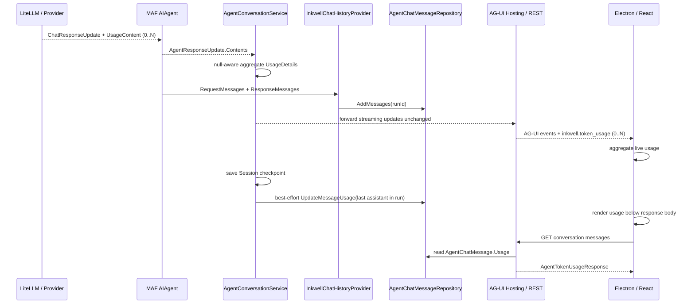

<!-- markdownlint-disable MD025 MD060 -->

# HD-022 · 回复级 Token 用量统计

> 本 HD 是 [HD-017](./HD-017-Inkwell.Core.Conversations.md) 的增量设计，覆盖 Core、Persistence、WebApi 与 Electron 的 Token usage 数据链。本文档的 `status` / `reviewers` 由 Owner 人工维护。
>
> **源码核验结论**：MAF 的流式 usage 位于 `AgentResponseUpdate.Contents` 中的 `UsageContent.Details`；`ChatHistoryProvider.InvokedContext.ResponseMessages` 不携带 usage；Tool loop 可产生多个 `UsageContent`，调用方需按类别累加；取消或断流时 usage 不是必达事件。依据为 Agent Framework `ChatClientAgent.RunCoreStreamingAsync`、`UsageAggregator`、`ChatHistoryProvider` 与 OpenAI Hosting `AIAgentChatCompletionsProcessor` 的当前源码。

## 1. 模块概述

### 1.1 职责

本增量承担：

- 捕获一个逻辑 Agent Run 内所有 Provider 实报的 `UsageDetails`。
- 把正常完成 Run 的聚合 usage 关联到该 Run 最后一条 assistant 消息。
- 通过 Conversation REST、Electron IPC 与聊天 UI 展示输入、输出和总 Token。
- 保留 Provider 报告的强类型细分计数与 `AdditionalCounts`，供后续 Trace 或 UI 扩展使用。

### 1.2 范围

**在内**：

- 正常完成的非流式与流式 Conversation Run。
- `agent_chat_messages` 可空原生 JSON usage 列。
- 历史消息 REST 回显与 Electron 实时 / 历史展示。
- SQL Server / PostgreSQL Migration 与契约测试。

**不在内**：

- 费用、账单、配额、预算和分析聚合。
- `Inkwell.Core.Traces` 的逐模型调用 usage 明细。
- 停止、断流或失败 Run 的部分 usage 展示与持久化。
- 独立 `agent_runs`、`token_usage` 或分析事实表。

### 1.3 关键决策摘要

| ID  | 决策                                                                                               | 性质     | 依据                                                                                                              |
| --- | -------------------------------------------------------------------------------------------------- | -------- | ----------------------------------------------------------------------------------------------------------------- |
| Q1  | 业务层直接复用 `Microsoft.Extensions.AI.UsageDetails`，不复制 Token 字段模型                       | 作者判断 | `Inkwell.Abstractions` 已依赖 Microsoft.Extensions.AI，`AgentChatMessage.Message` 已直接复用 `ChatMessage`        |
| Q2  | usage 作为 `AgentChatMessage.Usage` 可空 JSON 值保存                                               | 作者判断 | 产品展示、读取与删除生命周期均属于 assistant 消息；REQ-020 不要求跨 Run 分析                                      |
| Q3  | Tool loop 的多个 `UsageContent` 按字段空值感知累加                                                 | 框架语义 | MAF `UsageAggregator` / `AgentResponseExtensions.ToAgentResponse` 使用相同语义                                    |
| Q4  | 只在 Run 正常完成时持久化最终 usage                                                                | 产品边界 | REQ-020 EX-022 明确不展示部分统计；取消 / 断流时 usage 可能缺失                                                   |
| Q5  | Session checkpoint 先按现有路径保存，随后 best-effort 更新 usage；usage 失败不把已生成回复改判失败 | 产品边界 | 回复正文已经提交并可能已经通过 SSE 到达客户端；EX-023 要求降级为无 usage                                          |
| Q6  | 不把 usage 写入 `ChatMessage.Contents` 或 `AdditionalProperties`                                   | 作者判断 | MAF 在组装 `ChatResponse` 时把 `UsageContent` 提取到 `Usage`，History callback 看不到该内容；usage 不是聊天上下文 |
| Q7  | Electron 可把流中 usage 聚合到运行快照用于恢复，正常完成前不进入聊天消息                            | 产品边界 | Tool loop 的中间 usage 只是部分值；REQ-020 EX-022 禁止在聊天 UI 展示部分统计                                     |

## 2. 数据与控制流



关键顺序：`ChatHistoryProvider` 在 MAF Run 内先提交消息；`AgentConversationService` 只有在 `RunAsync` 返回或 `RunStreamingAsync` 自然枚举结束后，才把聚合 usage 更新到该 Run 最后一条 assistant 消息。`ListHistoryMessagesAsync` 继续只返回 `ChatMessage`，usage 不重新注入模型上下文。

## 3. 程序文件设计

### 3.1 Abstractions

| 文件                                         | 设计增量                                                                                                                                                                                                           |
| -------------------------------------------- | ------------------------------------------------------------------------------------------------------------------------------------------------------------------------------------------------------------------ |
| `Agent/Conversations/AgentChatMessage.cs`    | 新增 `public UsageDetails? Usage { get; init; }`；`null` 表示 Provider 未报告、Run 未正常完成或 usage 更新失败，不表示零用量。                                                                                     |
| `Persistence/IAgentChatMessageRepository.cs` | 新增 `Task<bool> UpdateMessageUsage(Guid conversationId, Guid messageId, UsageDetails usage, DateTimeOffset updatedTime, CancellationToken ct = default)`；只更新 usage 与 `UpdatedTime`，目标不存在返回 `false`。 |

`UsageDetails` 的全部强类型字段及 `AdditionalCounts` 原样保留。聚合时：两个非空值相加；一侧为空取另一侧；两侧均空保持空。不得根据 `InputTokenCount + OutputTokenCount` 补写 Provider 未报告的 `TotalTokenCount`。

### 3.2 Core

| 文件                                        | 设计增量                                                                                                                                                                                                                        |
| ------------------------------------------- | ------------------------------------------------------------------------------------------------------------------------------------------------------------------------------------------------------------------------------- |
| `AgentRuntime/AgentTokenUsageAggregator.cs` | 新增 internal static helper；输入 `UsageDetails? current, UsageDetails? incoming`，返回不修改入参的新聚合对象；覆盖 input/output/total/cached/reasoning/input audio/input text/output audio/output text 与 `AdditionalCounts`。 |
| `AgentRuntime/AgentConversationService.cs`  | 非流式读取 `AgentResponse.Usage`；流式从每个 `AgentResponseUpdate.Contents.OfType<UsageContent>()` 累加。仅正常完成后调用 `PersistUsageAsync`，并继续原样 yield update。                                                        |

`PersistUsageAsync` 固定流程：

1. usage 为 `null` 时直接返回。
2. `ListMessagesByRun(conversationId, executionId)`。
3. 按 `RunMessageIndex` 降序选择最后一条 `Message.Role == ChatRole.Assistant` 的消息。
4. 调用 `UpdateMessageUsage`。
5. 查询、选择或更新任一步骤抛异常，或找不到 assistant 消息 / 更新返回 `false` 时，统一记录 warning；日志只含 `ConversationId` / `ExecutionId` / `MessageId`，不记录消息正文、usage 扩展字典或用户输入。

非流式 `RunAsync` 返回或流式自然枚举结束后，先调用现有 `SaveSessionAsync`；Session 保存成功后再调用由完整 `try/catch` 包裹的 `PersistUsageAsync`。流式枚举被取消、抛错或由消费方提前终止时，不保存 Session，也不进入 usage 持久化。usage 查询或更新失败不得覆盖已成功的 Run 结果或已保存的 Session checkpoint。

### 3.3 Persistence.EFCore

| 文件                                           | 设计增量                                                                                                                                                                                                              |
| ---------------------------------------------- | --------------------------------------------------------------------------------------------------------------------------------------------------------------------------------------------------------------------- |
| `Entities/AgentChatMessageEntity.cs`           | 新增 `string? Usage`；列名表达业务语义，不使用 `UsageJson`。                                                                                                                                                          |
| `Mapping/AgentChatMessageUsageSerializer.cs`   | 新增 usage 专用 `System.Text.Json` serializer，固定使用只读的 `JsonSerializerOptions.Web`（camelCase、默认严格数字处理）；不得复用只面向 `ChatMessage` 的私有 `AgentChatMessageSerializer` 选项，也不开放运行时配置。 |
| `Mapping/AgentChatMessageMappingExtensions.cs` | 调用专用 serializer 在 `UsageDetails` 与 JSON 间往返；`null` 原样映射。                                                                                                                                               |
| `Repositories/AgentChatMessageRepository.cs`   | 实现精确 `(ConversationId, MessageId)` 条件的 `ExecuteUpdateAsync`，只设置 `Usage` 与 `UpdatedTime`。                                                                                                                 |
| `PostgresModelCustomizer.cs`                   | `Usage` 映射为 `jsonb`。                                                                                                                                                                                              |
| `SqlServerModelCustomizer.cs`                  | `Usage` 映射为 `json`。                                                                                                                                                                                               |
| 双 Provider `Migrations/`                      | 必须分别用 `dotnet ef migrations add AddAgentChatMessageUsage` 生成 nullable 原生 JSON 列；禁止手写 Migration / Designer / Snapshot。                                                                                 |

序列化固定使用 `JsonSerializerOptions.Web` 并验证 `AdditionalPropertiesDictionary<long>` 往返。PostgreSQL `jsonb` 会规范化属性顺序，测试使用结构化 JSON 或反序列化后字段断言，不比较原始字符串。

### 3.4 WebApi

新增 `Conversations/AgentTokenUsageResponse.cs`，稳定 HTTP 形状如下：

```csharp
public sealed record class AgentTokenUsageResponse
{
    public long? InputTokenCount { get; init; }
    public long? OutputTokenCount { get; init; }
    public long? TotalTokenCount { get; init; }
    public long? CachedInputTokenCount { get; init; }
    public long? ReasoningTokenCount { get; init; }
    public IReadOnlyDictionary<string, long>? AdditionalCounts { get; init; }
}
```

`AgentChatMessageResponse` 新增 `AgentTokenUsageResponse? Usage`。`AgentConversationsController.ToMessageResponse` 显式映射，不直接把可变的 `UsageDetails` 暴露为 HTTP Response。现有授权与分页接口不变。

### 3.5 Electron 与 React

| 文件                                  | 设计增量                                                                                                                                                                                                                                                          |
| ------------------------------------- | ----------------------------------------------------------------------------------------------------------------------------------------------------------------------------------------------------------------------------------------------------------------- |
| `shared/network/contracts.ts`         | 新增 `ChatTokenUsage`，字段使用 camelCase 可空数值；`ChatMessage.usage?` 与 `ChatRunSnapshot.usage?` 复用该类型。                                                                                                                                                 |
| `electron/chat-token-usage.ts`        | 新增纯函数，把 `inkwell.token_usage` custom event 的 camelCase nullable 字段空值感知累加；无字段时返回原值。                                                                                                                                                    |
| `electron/main.ts`                    | 使用官方 `@ag-ui/client` `HttpAgent` 消费事件；`onCustomEvent` 聚合 `inkwell.token_usage` 到 Run 快照，`onToolCallResultEvent` 按调用完成活动。仅 Run 正常完成时把最终 usage 合入消息；stopped / failed 路径不把部分 usage 合入消息。历史 REST 映射读取 `usage`。   |
| `features/chat/chat-panel.tsx`        | `applySnapshot` 与 active-run 恢复路径把 completed snapshot usage 合并进 assistant `ChatMessage`；stopped / failed 不复制 pending usage；Conversation 历史加载以后端 `usage` 覆盖本地值。                                                                         |
| `features/chat/chat-token-usage.tsx`  | 新增展示组件；只在至少一个 input/output/total 字段非空时渲染，顺序固定为输入、输出、总计。                                                                                                                                                                        |
| `features/chat/chat-message-list.tsx` | usage 放在回复正文之后、`Actions` footer 之前；只读取完成态消息的 usage，运行中不展示。                                                                                                                                                                           |
| `shared/i18n/resources.ts`            | 新增 `chat.usage.input` / `output` / `total` / `tokens` 的 `zh-CN` 与 `en-US` 资源。                                                                                                                                                                              |
| `index.css`                           | 使用已有次级文本色与紧凑间距，不新增卡片、Tag 或独立气泡。                                                                                                                                                                                                        |

MAF 默认 AG-UI 转换器不会为 `UsageContent` 生成标准事件。WebApi 通过 endpoint `AGUIStreamOptions.MapContent` 把每个 `UsageContent` 映射为名为 `inkwell.token_usage` 的 `CUSTOM` 事件，payload 使用与 `ChatTokenUsage` 相同的 camelCase nullable 字段。Tool loop 可产生多个事件，因此 Electron 必须累计，不能“最后一个事件胜出”。正式 Conversation 重新读取历史时，以后端直接捕获并持久化的 nullable `UsageDetails` 为准。

桌面端 completed 的判据固定为：`HttpAgent.runAgent` 正常完成且该 Run 未 Abort、未收到 `RUN_ERROR`。不得使用单个 usage event 判定完成；`RUN_FINISHED` 与流正常结束由官方客户端处理。

## 4. 数据库设计增量

在 `agent_chat_messages` 增加：

- `Usage`：`string?` / nullable JSON；PostgreSQL 类型 `jsonb`，SQL Server 类型 `json`。
- JSON 内容是 `UsageDetails` 的完整序列化结果，包括可空强类型计数与可空 `AdditionalCounts`。
- 不新增索引、CHECK 约束或独立外键；v1 不按 usage 查询、筛选或聚合。

删除单条消息、清空 Conversation、删除 Conversation 与删除 Agent 时，usage 随所属消息沿现有生命周期删除。历史行迁移后 `Usage = null`，不回填估算值。

## 5. 一致性与失败语义

- 消息批次是首要事实，usage 是可降级的附加事实；usage 更新失败不回滚已提交消息。
- 同一 `(ConversationId, ExecutionId)` 重试时，`UpdateMessageUsage` 对同一结果幂等覆盖；不得做累加更新，避免网络重试重复计数。
- 实时 Electron 聚合与后端持久化聚合不是分布式事务。重新加载正式 Conversation 历史后以后端持久化值为准。
- Provider 报告 `0` 与未报告 `null` 必须区分。
- `TotalTokenCount` 独立累加，不从 input/output 推导。

## 6. 测试要求

### 6.1 Core

- 单个 usage、多个 Tool loop usage、部分字段为空、`AdditionalCounts` 同键累加、入参不被修改。
- 非流式正常完成持久化 `AgentResponse.Usage`。
- 流式多个 `UsageContent` 聚合后更新最后一条 assistant 消息。
- 无 usage、取消、异常、提前停止枚举均不更新。
- usage 更新失败时回复仍完成并记录 warning。

### 6.2 Persistence

- SQL Server / PostgreSQL `UsageDetails` 全字段与 `AdditionalCounts` 往返。
- `UpdateMessageUsage` 只更新目标消息；错误 ConversationId / MessageId 返回 `false`。
- 历史旧行 `Usage = null` 正常读取。
- Migration 生成的列类型分别为 `json` / `jsonb`。

### 6.3 WebApi 与 Desktop

- REST `usage` 字段 camelCase、nullable 与历史分页映射。
- Electron 单事件与多事件 pending usage 聚合；未知字段不破坏解析；无 usage event 不产生 `0`；中间 usage 可进入主进程 snapshot，但运行中消息不展示。
- `RUN_FINISHED` 正常完成后发布 completed usage；Abort、协议错误、stopped 与 failed 均不把 pending usage 合入消息。
- `chat-panel.tsx` 的 `applySnapshot`、active-run 恢复与历史覆盖规则均有测试。
- React 位置在正文之后、Actions 之前；中英文标签与 locale 数字格式。
- Electron E2E 覆盖实时完成后显示、切换 Conversation 后从历史恢复、无 usage 时不显示。

## 7. 实施顺序

1. REQ-020 与本 HD 经 Owner 评审。
2. Abstractions / Core aggregator 与单元测试。
3. EF Entity / Mapping / Repository，并用 CLI 生成双 Provider Migration。
4. WebApi Response 与历史接口测试。
5. Electron AG-UI 聚合、React 展示、i18n 与 E2E。
6. 全量 `dotnet build`、目标测试、desktop lint / Vitest / build / Electron Playwright。

## 8. 评审结论

REQ-020 与本 HD 已由 Owner 审阅。产品边界为展示完成 Run 的聚合值，不做成本分析，不在聊天 UI 展示部分 usage；后续是否把增量需求合入主需求文档不影响本设计的当前状态。
