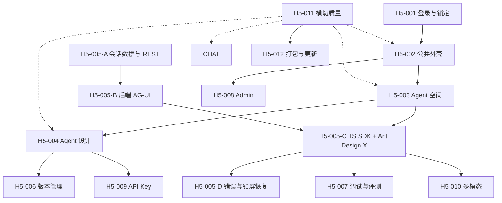

<!-- markdownlint-disable MD025 -->

# Desktop 实施路线图

> 本路线图是 Desktop H5 实施单元的总览，不可直接交给 `h5-coding-executor`；可执行任务必须使用 `docs/_templates/implementation-task-brief.template.md` 单独起草。

## 1. 目标

以 `docs/01-requirements/ui-spec.md` 的页面清单和真实代码为基线，将 Desktop 实施拆成可独立验证、可单独交给 H5 编码 Agent 的工程单元。

原型 `prototypes/inkwell-visual-design/` 只提供页面结构、交互语义和视觉基线；产品实现必须使用真实 API、真实鉴权状态和真实流式协议，不复制 mock 数据、触发词或定时时间线。

依赖采用“**架构约束内的最新稳定版**”：每个任务起草时通过 npm 查询并记录版本；允许在已锁定主版本内升级到最新稳定版。若最新版本跨越 `AGENTS.md` 或 ADR 锁定的主版本，必须先完成架构变更，不允许 H5 编码任务顺带越级升级。

## 2. 当前实现基线

已经存在：

- Electron main / preload / renderer 安全隔离。
- 登录、会话恢复、Token 安全存储、登出和锁定。
- Agent“我的”列表、模型列表和创建 Agent 的基础调用。
- OpenAI Chat Completions SSE 文本流。
- 登录相关 Electron Playwright E2E。

已知偏差：

1. 新建 Agent 后立即发布，违反 REQ-015 的草稿/发布分离语义。
2. AppShell、Agent 空间、Agent 设计和 Agent 会话尚未按已确认原型分成独立页面。
3. 产品端仍使用 Ant Design 5；截至 2026-07-15，npm 最新稳定版为 `antd 6.5.1`、`@ant-design/icons 6.3.2`、`@ant-design/x 2.8.0`、`@ant-design/x-markdown 2.8.0`。
4. 对话历史仅在组件内存，尚未满足 NFR-005 / AC-084。
5. 产品端直接解析 Chat Completions chunk，尚未接入最新稳定的官方 TypeScript SDK `@ag-ui/client 0.0.57` / `@ag-ui/core 0.0.57`。
6. 后端已经通过 MAF `MapAGUI("/agent/{agentId}", agent)` 暴露 AG-UI 端点，但与 ADR-012 中 `/api/runs` + 状态兜底端点的描述存在漂移，心跳、鉴权、错误、取消、断线兜底和集成测试尚未闭环。

## 3. 实施拆分原则

- 页面不等于任务：复杂页面按数据契约和可验收流程继续拆分。
- 横切能力独立：AppShell、错误处理、平台适配和发布流程不塞入某个业务页面。
- 已实现能力先核验：登录与锁定写实施记录，不重新立项重做。
- 后端未提供稳定服务的页面保持 `scope` 状态，不用 mock 假装完成。
- Renderer 只能通过 typed preload / IPC 访问后端，不能直接请求 URL 或 Node.js API。
- AG-UI 采用后端优先顺序：先锁定并验证 MAF Hosting 的真实端点与事件契约，再接入 TypeScript SDK 和 Ant Design X；不得先以 Chat Completions 私有 chunk 结构完成正式前端状态机。
- 前端依赖升级必须先查询 npm 最新稳定版；跨架构锁定主版本的升级必须先回到 H2 处理。

## 4. 实施依赖



## 5. 实施单元边界

### H5-001 登录、会话与锁定

覆盖 UI-001、UI-002、REQ-001、NFR-003 和 OQ-017 在途任务特例。当前主体代码已存在，下一步是补齐锁定、解锁、会话恢复和在途流式请求的验证证据。

### H5-002 公共外壳与全局体验

只负责顶栏、三组两级导航、权限可见性、网络状态、全局错误条和页面容器。工具、Skills、模型入口在 v1 只显示占位，不实现管理能力。

### H5-003 Agent 空间与基础管理

覆盖 UI-003 和 REQ-002。包括我的/团队共享、卡片网格、搜索筛选、刷新、删除、共享和按发布状态点击分流。不得把 Agent 配置表单或聊天实现塞入本单元。

### H5-004 Agent 设计与配置

覆盖 UI-004 和 REQ-003～009、REQ-010 的记忆配置部分、REQ-015 的草稿/发布动作。该范围仍较大，正式执行前至少拆为：

- H5-004-A：基础属性、Instructions、模型与参数。
- H5-004-B：工具与 Skills 绑定。
- H5-004-C：知识库与长期记忆配置。
- H5-004-D：草稿保存、发布和只读权限状态。

### H5-005 Agent 会话

覆盖 UI-005、REQ-010 和 REQ-018 的 AG-UI 端到端路径。后端优先，正式执行前至少拆为：

- H5-005-A：Conversation 三模型、Repository、Service、REST、原子租约与双 Provider Migration。
- H5-005-B：真实 TypeScript SDK 发包验证 MAF AG-UI、SessionStore、HistoryProvider 与完整消息快照契约。
- H5-005-C：Electron `@ag-ui/client` / `@ag-ui/core` + Ant Design X / XMarkdown、会话加载与跨设备恢复。
- H5-005-D：失败、停止、重试、断线兜底、部分回复持久化和锁屏期间结果累积。

### H5-006 版本管理

覆盖 UI-008 和 REQ-015 的版本列表、快照 diff 与回滚。后端已有版本端点，可在 H5-004-D 稳定后单独实施。

### H5-007 调试与评测

覆盖 UI-007、REQ-014。需要 Trace 查询、评测集和回放的 H3/API 设计先完成，不与聊天页一起临时实现。

### H5-008 Admin 管理

覆盖 UI-009、REQ-017。只包括账号解封和撤销他人共享，不扩展为 RBAC 或通用后台。

### H5-009 API Key 与外部协议

覆盖 REQ-013、REQ-018。API Key 管理 UI 与服务端四协议兼容端点是不同切片，应分别实现和验证。

### H5-010 多模态输入

覆盖 REQ-016。图片、语音和文档三条链路分别依赖模型能力、Speech 与文件/RAG 服务，正式执行时继续拆成三个任务。

### H5-011 桌面横切质量

覆盖 EX-001、401、429、5xx 的统一体验、无障碍、窗口最小尺寸、性能和 Windows/macOS 双平台验证。各业务单元必须同步满足，不留到最后一次性补救。

### H5-012 桌面打包与更新

覆盖 Electron 安装包、代码签名、公证、自动更新和发布通道。当前 H1 页面清单未展开这些内容，实施前需要补充发布约束和凭据管理方案。

## 6. 通用验证基线

每个 Desktop 工程单元至少执行：

```shell
npm --prefix src/app/desktop run build
npm --prefix src/app/desktop run lint
npm --prefix src/app/desktop run test
npm --prefix src/app/desktop run test:e2e
dotnet build
```

涉及 main / preload / renderer 契约的变更必须有 Electron E2E。涉及布局的变更必须验证默认窗口和最小窗口；涉及流式、上传或录音的变更必须验证锁定期间禁止新写操作且在途任务不被丢弃。

依赖任务还必须记录 `npm view <package> version` 查询结果。2026-07-15 的基线仅供追溯，不作为未来任务的永久版本锁：

| 包 | 2026-07-15 最新稳定版 |
| --- | --- |
| `react` | `19.2.7` |
| `react-dom` | `19.2.7` |
| `antd` | `6.5.1` |
| `@ant-design/icons` | `6.3.2` |
| `@ant-design/x` | `2.8.0` |
| `@ant-design/x-markdown` | `2.8.0` |
| `@ag-ui/client` | `0.0.57` |
| `@ag-ui/core` | `0.0.57` |
| `@tanstack/react-query` | `5.101.2` |
| `zustand` | `5.0.14` |
| `electron` | `43.1.1` |
| `vite` | `8.1.4`（当前架构锁定 6.x，不能直接采用） |
| `typescript` | `7.0.2`（当前架构锁定 5.x，不能直接采用） |

## 7. 总体完成定义

- UI-001～UI-005、UI-007～UI-009 使用真实 API，不依赖原型 mock 数据。
- UI-010～UI-012 只保留需求锁定的占位行为。
- 草稿、发布、版本回滚和 Agent 点击分流符合当前 H1 文档。
- 对话使用 AG-UI，历史消息由服务端提供且可跨设备恢复。
- Electron 安全配置没有放宽，Renderer 不直接访问 Node.js 或后端。
- Desktop 全量检查、Electron E2E、双平台验证和 `dotnet build` 通过。
