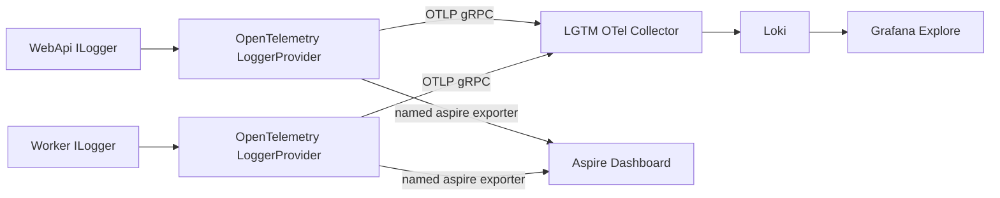

<!-- markdownlint-disable MD025 -->

# 日志现状与生产治理缺口

本文记录 Inkwell 日志链路截至 2026-07-21 的真实实现、已验证能力和生产治理缺口，防止 Agent 核心功能完成后遗漏可观测性收尾工作。本文不是待立即执行的任务简报，也不改变 [ADR-013](../../03-architecture/adr/ADR-013-observability-otel-self-hosted-grafana.md) 的架构决策。

## 1. 结论

WebApi 与 Worker 的应用日志主干符合现代 .NET + OpenTelemetry 基线：业务代码使用 `ILogger<T>`，OpenTelemetry LoggerProvider 通过 OTLP 输出结构化日志，日志携带 `service.name`、`trace_id` 与 `span_id`，最终由 Loki 存储并在 Grafana 查询。

当前不能表述为“系统所有日志均已接入 Loki”。Migrator、AppHost/DCP、Desktop/Electron、LiteLLM、数据库及 Kubernetes 平台日志尚未形成统一采集链路；生产 Collector/Alloy、脱敏、容量治理与告警也尚未落地。

当前优先级保持为 **Agent 核心功能优先**。本文所列工作进入后续可观测性 backlog，待 Agent 核心运行链路稳定后按 §6 的顺序实施。

## 2. 当前日志链路



实现位置：

- `src/core/Inkwell.WebApi/Program.cs`：注册 WebApi OpenTelemetry Logging，设置 `service.name=inkwell-webapi`，配置默认 OTLP exporter 与可选 Aspire named exporter。
- `src/core/Inkwell.Worker/Program.cs`：注册 Worker OpenTelemetry Logging，设置 `service.name=inkwell-worker`，配置默认 OTLP exporter 与可选 Aspire named exporter。
- `src/core/Inkwell.AppHost/Program.cs`：向 WebApi/Worker 注入 `OTEL_EXPORTER_OTLP_ENDPOINT` 与 `OTEL_EXPORTER_OTLP_PROTOCOL=grpc`，目标为本地 `otel-lgtm` 的 `otlp-grpc` endpoint；同时注入 Aspire Dashboard OTLP endpoint。

业务代码不依赖 Serilog、NLog 或 log4net。当前没有引入这些框架的必要；除非未来出现本地滚动文件、特殊 Sink 或复杂进程内路由等明确需求，否则继续使用 `ILogger<T> + OpenTelemetry`。

## 3. 已验证基线

2026-07-21 在本地 Aspire/LGTM 环境完成以下验证：

- Loki 的 `service_name` 标签值包含 `inkwell-webapi` 与 `inkwell-worker`。
- WebApi 日志包含 ASP.NET Core 请求、Controller action 与结构化模板属性。
- 日志包含 `trace_id`、`span_id`，可与 Tempo trace 关联。
- WebApi/Worker 日志同时写入本地 LGTM 和 Aspire Dashboard。
- Agent telemetry 保持 `EnableSensitiveData=false`，消息正文不进入 OpenTelemetry 通道。

常用 LogQL：

```logql
{service_name="inkwell-webapi"}
```

```logql
{service_name="inkwell-worker"}
```

```logql
{service_name=~"inkwell-webapi|inkwell-worker"}
  | detected_level="error"
```

## 4. 日志覆盖矩阵

| 日志来源 | 当前进入 Loki | 当前查看入口 | 目标处理方式 |
| --- | --- | --- | --- |
| WebApi `ILogger` | 是 | Grafana/Loki、Aspire | 保持 OTLP 结构化日志 |
| Worker `ILogger` | 是 | Grafana/Loki、Aspire | 保持 OTLP 结构化日志 |
| Migrator | 否 | Aspire Console、Helm Job logs | 按 RISK-015 保持 Job 标准日志，由生产 Alloy 采集 Pod stdout/stderr |
| AppHost/DCP | 否 | Aspire Console | 仅本地开发使用，不作为生产日志源 |
| Desktop/Electron | 否 | 本地开发控制台 | 单独设计客户端诊断与用户授权上传，不接入集群 Alloy |
| 视觉原型/Vite | 否 | 本地开发控制台 | 非产品运行时，不纳入生产日志平台 |
| LiteLLM | 否 | Aspire Console/容器日志 | 由生产 Alloy 采集 Pod stdout/stderr |
| PostgreSQL/SQL Server | 否 | Aspire Console/容器日志 | 由平台日志采集；生产优先使用数据库原生审计与监控能力 |
| PgAdmin | 否 | Aspire Console/容器日志 | 开发辅助资源，不纳入生产应用日志 SLA |
| Kubernetes Events | 否 | `kubectl`/平台工具 | 由 Alloy Kubernetes source 采集 |
| 任意 `Console.WriteLine` | 否 | 进程 stdout | 产品代码应优先改用 `ILogger<T>`；第三方进程 stdout 由 Alloy 采集 |

## 5. 生产缺口

### 5.1 Collector/Alloy 生产管线

本地 `grafana/otel-lgtm` 只用于开发、演示和测试。生产需要部署 Grafana Alloy 或上游 OpenTelemetry Collector，至少配置：

- OTLP receiver；
- memory limiter；
- batch processor；
- exporter retry 与 sending queue；
- Kubernetes metadata enrichment；
- 敏感属性 redaction；
- metrics、traces、logs 三类 signal 转发；
- Collector 自身健康、丢弃量和 export failure 监控。

### 5.2 全系统日志覆盖

生产 Alloy 需要采集非 OTLP 工作负载的 Pod stdout/stderr 与 Kubernetes Events。WebApi/Worker 已经通过 OTLP 输出日志，stdout 采集必须排除这两个容器，或关闭其 Console provider，防止同一条日志经 OTLP 和 stdout 重复进入 Loki。

Desktop/Electron 不属于 Kubernetes 工作负载，不能依赖集群 Alloy。客户端日志上传涉及用户授权、脱敏、离线缓存、容量限制和崩溃报告，应作为独立设计范围处理。

### 5.3 Resource 属性

生产 telemetry 应稳定补充：

- `service.name`；
- `service.namespace=inkwell`；
- `service.version=<image tag 或 commit>`；
- `service.instance.id=<pod name>`；
- `deployment.environment=production`；
- `k8s.namespace.name`、`k8s.pod.name`、`k8s.container.name`。

其中 Kubernetes 属性优先由 Alloy/Collector enrichment 统一添加，避免每个应用重复配置。

### 5.4 日志级别与噪声控制

需要按环境固化最小日志级别并验证实际摄入量。生产建议从以下基线开始，再根据排障需求调整：

- Inkwell 业务日志：`Information`；
- `Microsoft.AspNetCore`：`Warning`，保留必要请求摘要时单独放行；
- EF Core command：`Warning`，禁止默认记录 SQL 参数中的敏感值；
- Debug/Trace：生产默认关闭。

日志级别配置必须保持 WebApi/Worker 一致，并允许通过部署配置调整，不在业务代码中硬编码。

### 5.5 脱敏与高基数治理

应用层与 Collector 层共同保证以下内容不得进入日志或 Loki label：

- Authorization、Cookie、Session Token、API Key、数据库连接字符串；
- 用户消息、系统提示词、工具参数和文件正文；
- 密码、临时凭据与供应商密钥；
- 未脱敏的个人信息。

`agent.id`、`conversation.id`、`user.id`、`trace_id` 等高基数值可以作为结构化 metadata 用于精确查询，但不得提升为 Loki 索引 label。单次调用关联优先使用 Tempo trace。

### 5.6 保留、容量与成本

生产部署需要明确：

- Loki retention 与租户配额；
- 每日摄入量和单服务预算；
- 单条日志最大长度与截断策略；
- 高基数 label 审核；
- Debug 日志临时开启和自动回收机制；
- Dashboard/LogQL 查询性能基线。

### 5.7 告警与运行手册

至少补齐以下告警：

- WebApi/Worker error log rate；
- 未处理异常；
- Collector export failure、queue saturation 和 dropped records；
- Loki ingestion failure；
- 服务日志突然归零；
- 单服务日志摄入量异常增长。

告警必须附带运行手册链接，说明查询语句、可能原因、验证步骤和升级路径。

## 6. 后续实施顺序

以下顺序在 Agent 核心功能里程碑完成后执行：

1. **生产管线**：部署 Alloy/Collector，接入 Grafana Cloud 或自托管 Grafana 栈，启用 batch、memory limiter、retry 和 sending queue。
2. **资源属性与脱敏**：统一 environment/version/Kubernetes attributes，增加敏感字段清理和高基数保护。
3. **平台日志覆盖**：采集 Migrator、LiteLLM、数据库 Pod stdout/stderr 与 Kubernetes Events，排除 WebApi/Worker 重复 stdout。
4. **日志级别与成本治理**：固化环境配置，测量摄入量，设置 retention、配额和截断策略。
5. **Dashboard、告警与运行手册**：交付日志健康面板、告警规则和排障文档。
6. **Desktop 诊断设计**：单独评审客户端日志、崩溃报告和用户授权上传方案，不与服务端日志采集合并实现。

进入实施前应把每一步拆成独立 `ai-task-brief.md`，一次只交付一个可验证切片，不在 Agent 核心功能开发中顺手扩展。

## 7. 完成定义

日志治理工作仅在满足以下条件后可标记完成：

- WebApi、Worker、Migrator、LiteLLM 与生产基础设施的目标日志源均可在 Grafana 查询；
- WebApi/Worker 无 OTLP/stdout 重复日志；
- logs 与 traces 可通过 `trace_id` 关联；
- Secret、消息正文与工具参数脱敏验证通过；
- 生产 Resource 属性完整且可按环境、版本、Pod 筛选；
- Collector 断网、重启和后端限流场景下的 retry/queue 行为通过集成验证；
- retention、摄入配额、日志级别和高基数限制已配置；
- 告警规则已通过故障注入验证，并具备运行手册；
- Desktop 日志明确完成独立方案，或由 Owner 明确决定延后范围。

## 8. 明确不做

- 不因本 backlog 引入 Serilog、NLog 或 log4net。
- 不把 OTel 日志当作审计日志、对话历史或调试样本存储。
- 不开启 Agent 全局敏感数据采集。
- 不把用户消息、Prompt、工具参数作为 Loki label。
- 不为了“全覆盖”采集视觉原型等非产品运行时的全部控制台输出。
- 不在 Agent 核心功能开发期间顺手实施本清单；除非出现阻塞核心功能的日志缺口。
