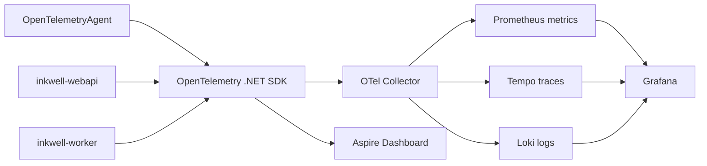
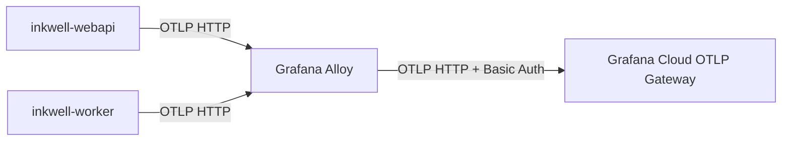

<!-- markdownlint-disable MD025 -->

# Grafana 指标查看指南

本文说明如何在 Inkwell 本地开发环境中查看 OpenTelemetry 指标，并使用 Grafana、Prometheus 与 Tempo 分析 Agent 模型调用。本文是已落地实现的使用指南；架构决策见 [ADR-013](../../03-architecture/adr/ADR-013-observability-otel-self-hosted-grafana.md)，本地编排方式见 [ADR-025](../../03-architecture/adr/ADR-025-local-orchestration-aspire.md)。

## 1. 数据链路

本地 AppHost 同时启动 WebApi、Worker 和固定版本的 `grafana/otel-lgtm` 容器。应用通过 OTLP gRPC 上报 telemetry：



本地默认入口由 `src/core/Inkwell.AppHost/appsettings.json` 配置：

| 服务             | 地址                            | 用途                                 |
| ---------------- | ------------------------------- | ------------------------------------ |
| Grafana          | `http://localhost:6805`         | 统一查询 metrics、traces 和 logs     |
| Prometheus       | `http://localhost:6806`         | PromQL API 与原始指标检查            |
| Tempo            | `http://localhost:6807`         | Trace API                            |
| Loki             | `http://localhost:6808`         | LogQL API                            |
| Aspire Dashboard | AppHost 启动日志中的 HTTPS 地址 | 本地资源、trace、metric 和结构化日志 |

端口可通过 AppHost 的 `Ports` 配置覆盖。端口被修改后，以 Aspire 资源页显示的实际 URL 为准。

## 2. 启动与数据准备

在仓库根目录启动 AppHost：

```bash
dotnet run --project src/core/Inkwell.AppHost/Inkwell.AppHost.csproj
```

等待 Aspire 资源页中的 `otel-lgtm`、`webapi` 和 `worker` 进入 Running 状态，然后调用一次 Agent。只有发生真实模型调用后，`gen_ai.*` 指标才会产生数据。

打开 `http://localhost:6805`。本地 LGTM 已启用匿名 Admin，不需要输入 Grafana 用户名或密码。生产环境不得沿用该认证配置。

## 3. 在 Grafana Explore 查看指标

1. 在 Grafana 左侧导航打开 **Explore**。
2. 在页面顶部选择 **Prometheus** 数据源。
3. 将查询编辑器切换为 **Code** 模式。
4. 选择时间范围；刚完成调用时建议使用 **Last 15 minutes**。
5. 输入本指南中的 PromQL，然后选择 **Run query**。

当前 Agent telemetry 使用以下主要维度：

| 标签                    | 示例              | 含义                        |
| ----------------------- | ----------------- | --------------------------- |
| `service_name`          | `inkwell-webapi`  | 产生指标的服务              |
| `gen_ai_operation_name` | `chat`            | GenAI 操作类型              |
| `gen_ai_provider_name`  | `openai`          | M.E.AI 识别的 Provider 协议 |
| `gen_ai_request_model`  | `gpt-5.4`         | 请求模型                    |
| `gen_ai_response_model` | `gpt-5.4`         | Provider 实际响应模型       |
| `gen_ai_token_type`     | `input`、`output` | Token 类型                  |

不要依赖 `instance` 或 `service_instance_id` 做长期 Dashboard 聚合；它们会随应用实例重启而变化。

## 4. Agent 核心 PromQL

以下查询中的 `$__range` 和 `$__rate_interval` 是 Grafana 内置变量，只能直接用于 Grafana 查询。通过 Prometheus HTTP API 调试时，应替换为具体窗口，例如 `15m` 或 `5m`。

### 4.1 所选时间范围内的模型调用次数

```promql
sum(
  increase(
    gen_ai_client_operation_duration_seconds_count{
      service_name="inkwell-webapi"
    }[$__range]
  )
)
```

推荐 Visualization：**Stat**。该值表示时间范围内完成的 Chat Client 操作数，不等同于 HTTP 请求数。

### 4.2 每秒模型调用量

```promql
sum(
  rate(
    gen_ai_client_operation_duration_seconds_count{
      service_name="inkwell-webapi"
    }[$__rate_interval]
  )
)
```

推荐 Visualization：**Time series**，Unit 使用 `ops/s`。

### 4.3 平均模型调用耗时

```promql
sum(
  rate(
    gen_ai_client_operation_duration_seconds_sum{
      service_name="inkwell-webapi"
    }[$__rate_interval]
  )
)
/
sum(
  rate(
    gen_ai_client_operation_duration_seconds_count{
      service_name="inkwell-webapi"
    }[$__rate_interval]
  )
)
```

推荐 Visualization：**Time series**，Unit 使用 `seconds (s)`。

### 4.4 P95 模型调用耗时

```promql
histogram_quantile(
  0.95,
  sum by (le) (
    rate(
      gen_ai_client_operation_duration_seconds_bucket{
        service_name="inkwell-webapi"
      }[$__rate_interval]
    )
  )
)
```

推荐 Visualization：**Time series**，Unit 使用 `seconds (s)`。低调用量环境下 P95 会出现跳变，不能用单次本地调用判断性能回归。

### 4.5 Input/Output Token 总量

```promql
sum by (gen_ai_token_type) (
  increase(
    gen_ai_client_token_usage_sum{
      service_name="inkwell-webapi"
    }[$__range]
  )
)
```

推荐 Visualization：**Bar chart** 或 **Stat**，Legend 使用 `{{gen_ai_token_type}}`。

`gen_ai_client_token_usage` 是 histogram。累计 Token 应查询 `_sum`，不要查询不存在的 `_total`。

### 4.6 每次调用平均 Token 数

```promql
sum by (gen_ai_token_type) (
  rate(
    gen_ai_client_token_usage_sum{
      service_name="inkwell-webapi"
    }[$__rate_interval]
  )
)
/
sum by (gen_ai_token_type) (
  rate(
    gen_ai_client_token_usage_count{
      service_name="inkwell-webapi"
    }[$__rate_interval]
  )
)
```

推荐 Visualization：**Time series**，Legend 使用 `{{gen_ai_token_type}}`。

### 4.7 按模型统计 Token

```promql
sum by (gen_ai_request_model, gen_ai_token_type) (
  increase(
    gen_ai_client_token_usage_sum{
      service_name="inkwell-webapi"
    }[$__range]
  )
)
```

推荐 Legend：`{{gen_ai_request_model}} / {{gen_ai_token_type}}`。

### 4.8 按模型统计平均耗时

```promql
sum by (gen_ai_request_model) (
  rate(
    gen_ai_client_operation_duration_seconds_sum{
      service_name="inkwell-webapi"
    }[$__rate_interval]
  )
)
/
sum by (gen_ai_request_model) (
  rate(
    gen_ai_client_operation_duration_seconds_count{
      service_name="inkwell-webapi"
    }[$__rate_interval]
  )
)
```

该查询适合比较不同模型，但需要确认每个模型在所选窗口内都有足够调用量。

## 5. 查看原始指标与标签

当 Grafana 查询为空时，先在 Prometheus 中确认指标是否存在。

列出所有 GenAI 指标：

```bash
curl --fail --silent --show-error \
  'http://localhost:6806/api/v1/label/__name__/values' \
  | jq -r '.data[] | select(startswith("gen_ai"))'
```

检查调用耗时指标的实际标签：

```bash
curl --fail --silent --show-error \
  'http://localhost:6806/api/v1/series?match[]=gen_ai_client_operation_duration_seconds_count' \
  | jq -c '.data[]'
```

检查 Token 指标的实际标签：

```bash
curl --fail --silent --show-error \
  'http://localhost:6806/api/v1/series?match[]=gen_ai_client_token_usage_sum' \
  | jq -c '.data[]'
```

端口不是默认值时，从 Aspire 资源页复制 `otel-lgtm` 的 `prometheus` endpoint。

## 6. 从指标定位到 Trace

Metric 用于看趋势，单次 Agent 调用细节由 Tempo trace 提供。

1. 在 Grafana **Explore** 中把数据源切换为 **Tempo**。
2. 使用 Search 查询类型。
3. Service Name 选择 `inkwell-webapi`。
4. 找到名称为 `POST /agent/{agentId}/v1/chat/completions/` 的 trace。
5. 展开 trace，确认存在 `invoke_agent <Agent 名称>(<Agent ID>)` 与 `chat <模型名>` spans。

`OpenTelemetryAgent` 使用 `Inkwell.Agent` source 产生 Agent span，底层 Chat Client 产生模型调用 span。默认 `EnableSensitiveData=false`，消息正文不会进入 OTel；需要查看经过业务脱敏后的调试样本时，应使用后续 `Inkwell.Core.Traces` 业务能力，而不是打开全局敏感数据采集。

## 7. 保存为 Dashboard

在 Explore 中验证查询正确后：

1. 选择 **Add to dashboard**。
2. 新建或选择 Inkwell Dashboard。
3. 按各查询建议设置 Visualization、Unit 和 Legend。
4. Dashboard 时间范围建议默认 **Last 6 hours**，刷新间隔建议本地使用 `10s`、生产使用 `30s` 或更长。

建议至少创建以下面板：

| 面板               | 查询来源   | 推荐展示           |
| ------------------ | ---------- | ------------------ |
| Agent 调用数       | §4.1       | Stat               |
| Agent 调用速率     | §4.2       | Time series        |
| 平均/P95 延迟      | §4.3、§4.4 | Time series        |
| Input/Output Token | §4.5       | Bar chart          |
| 平均 Token/调用    | §4.6       | Time series        |
| 按模型成本代理量   | §4.7       | Table 或 Bar chart |

本地 `grafana/otel-lgtm` 容器没有在 AppHost 中挂载持久卷，容器重建后手工创建的 Dashboard 可能丢失。需要纳入仓库或用于生产时，应把 Dashboard 导出为 JSON 并通过 Grafana provisioning/Helm 管理，不能只保存在本地容器中。

## 8. 快速接入 Grafana Cloud

Inkwell 的默认 OTLP exporter 读取 OpenTelemetry 标准环境变量，因此接入 Grafana Cloud 不需要修改应用代码。Grafana Cloud 同一个 OTLP Gateway 可以接收 metrics、traces 和 logs。

### 8.1 快速方案：应用直连 Grafana Cloud

该方案适合快速验证、小规模环境或暂时无法部署 Collector 的场景。

1. 登录 Grafana Cloud Stack。
2. 打开 **Connections** → **Add new connection**。
3. 搜索并选择 **OpenTelemetry**。
4. 在 OpenTelemetry 配置页生成 Access Policy Token。
5. 复制页面生成的 `OTEL_EXPORTER_OTLP_PROTOCOL`、`OTEL_EXPORTER_OTLP_ENDPOINT` 和 `OTEL_EXPORTER_OTLP_HEADERS`。

WebApi 与 Worker Deployment 使用相同配置：

```yaml
env:
  - name: OTEL_EXPORTER_OTLP_PROTOCOL
    value: http/protobuf
  - name: OTEL_EXPORTER_OTLP_ENDPOINT
    value: https://otlp-gateway-prod-<region>.grafana.net/otlp
  - name: OTEL_EXPORTER_OTLP_HEADERS
    valueFrom:
      secretKeyRef:
        name: grafana-cloud-otel
        key: otlp-headers
  - name: OTEL_EXPORTER_OTLP_COMPRESSION
    value: gzip
  - name: OTEL_RESOURCE_ATTRIBUTES
    value: deployment.environment=production,service.namespace=inkwell
```

Secret 中的 `otlp-headers` 使用 Grafana Cloud Portal 原样生成的值，格式类似：

```text
Authorization=Basic <base64(account-id:access-policy-token)>
```

不要把 Account ID、Access Policy Token 或完整 Authorization header 写入 Git、Helm values 明文或应用日志。生产环境应通过 Kubernetes Secret、External Secrets 或现有 Secret 管理系统注入。

使用统一的 `OTEL_EXPORTER_OTLP_ENDPOINT` 时，.NET exporter 会自动追加以下路径：

- metrics：`/v1/metrics`
- traces：`/v1/traces`
- logs：`/v1/logs`

因此 endpoint 应使用 Portal 给出的 `/otlp` 基地址，不要手工追加 `/v1/metrics`。只有使用 `OTEL_EXPORTER_OTLP_METRICS_ENDPOINT` 等 signal-specific 变量时，才需要提供完整 signal 路径。

当前代码中的默认 unnamed exporter 会读取这些变量。`Inkwell:OpenTelemetry:AspireOtlpEndpoint` 仅用于 AppHost 本地双写，生产环境不配置即可。

直连方案的限制：应用进程承担重试与网络开销，不具备 Collector 级别的集中 batch、memory limiting、redaction、tail sampling、Kubernetes metadata enrichment 和后端路由能力；应用退出或长时间网络中断时，telemetry 可能丢失。

### 8.2 生产推荐：Grafana Alloy 中转

正式生产环境推荐在 Kubernetes 中部署 Grafana Alloy，由应用只向集群内 Alloy OTLP Receiver 上报，再由 Alloy 使用 HTTPS 和 Basic Auth 转发到 Grafana Cloud：



应用侧只需要配置集群内 endpoint，不持有 Grafana Cloud Token：

```yaml
env:
  - name: OTEL_EXPORTER_OTLP_PROTOCOL
    value: http/protobuf
  - name: OTEL_EXPORTER_OTLP_ENDPOINT
    value: http://grafana-alloy.monitoring.svc.cluster.local:4318
  - name: OTEL_RESOURCE_ATTRIBUTES
    value: deployment.environment=production,service.namespace=inkwell
```

Alloy 侧核心转发配置如下；实际部署优先使用 Grafana Cloud **OpenTelemetry with Grafana Alloy** connection tile 生成的 Helm values 和 Secret：

```alloy
otelcol.auth.basic "grafana_cloud" {
  username = sys.env("GRAFANA_CLOUD_ACCOUNT_ID")
  password = sys.env("GRAFANA_CLOUD_API_TOKEN")
}

otelcol.exporter.otlphttp "grafana_cloud" {
  client {
    endpoint = sys.env("GRAFANA_CLOUD_OTLP_ENDPOINT")
    auth     = otelcol.auth.basic.grafana_cloud.handler
  }
}
```

完整 Alloy pipeline 还应包含 OTLP receiver、memory limiter、batch processor 和 exporter 输出连线。由 Grafana Cloud connection tile 生成配置可以减少 endpoint、认证和 Helm 参数填写错误。

### 8.3 Grafana Cloud 中验证

部署后触发一次真实 Agent 调用，然后在 Grafana Cloud 中验证：

1. **Explore → Metrics** 查询 `gen_ai_client_operation_duration_seconds_count{service_name="inkwell-webapi"}`。
2. **Explore → Traces** 按 `service.name = inkwell-webapi` 查询，确认存在 `invoke_agent` 与 `chat <模型名>` spans。
3. **Explore → Logs** 按 `service_name = inkwell-webapi` 查询结构化日志。
4. 使用 §4 的 PromQL 创建 Dashboard；Grafana Cloud 与本地 Prometheus 的核心查询保持一致。

若 metrics 可见但 traces/logs 不可见，优先检查 Cloud Token scope、Alloy pipeline 的三类 signal output，以及是否误把 signal-specific endpoint 当作 base endpoint。

## 9. 常见问题

### 9.1 查询结果为空

按顺序检查：

1. AppHost 中 `otel-lgtm` 与 `webapi` 是否为 Running。
2. 时间范围是否覆盖最近一次 Agent 调用。
3. 是否发生了真实模型调用；只打开页面不会产生 GenAI 指标。
4. Grafana 数据源是否选择了 **Prometheus**。
5. `service_name` 是否为 `inkwell-webapi`；Worker 尚未执行 Agent 时不会有同类数据。
6. 使用 §5 的 Prometheus API 确认指标和标签是否存在。

### 9.2 有 HTTP 指标但没有 GenAI 指标

HTTP 指标来自 ASP.NET Core instrumentation，GenAI 指标来自 Agent/Chat Client telemetry。确认调用路径确实经过 `AgentFactory` 创建的 `OpenTelemetryAgent`，并且应用的 meter 配置包含 `Inkwell.Agent`。

### 9.3 调用次数出现小数

`increase()` 会根据时间窗口边界做外推，短窗口和低样本量下可能返回小数。需要查看原始累计样本时，可直接查询：

```promql
gen_ai_client_operation_duration_seconds_count{
  service_name="inkwell-webapi"
}
```

该值是进程生命周期内的累计值，应用重启后会重置，因此不适合作为跨实例业务总量。

### 9.4 Grafana 可见但 Aspire Dashboard 不可见

LGTM 与 Aspire Dashboard 是两个独立 OTLP 接收端。AppHost 会把 Aspire Dashboard endpoint 注入 `Inkwell:OpenTelemetry:AspireOtlpEndpoint`，WebApi/Worker 使用名为 `aspire` 的第二 exporter 双写。确认应用是由 AppHost 启动，而不是单独运行项目。

### 9.5 重启后历史数据消失

当前本地 LGTM 用于开发、演示和测试，未承诺跨容器生命周期保留数据。生产环境的数据保留和持久化策略以 ADR-013 与 Helm 配置为准。

## 10. 安全边界

- Agent telemetry 必须保持 `EnableSensitiveData=false`。
- 不得把用户消息、系统提示词、工具参数、API Key 或连接字符串放进 metric label；Prometheus 标签会被长期存储并建立索引。
- `agent.id`、`conversation.id` 等高基数值不应成为 metric label；单次调用关联应使用 trace。
- 本地 Grafana 匿名 Admin 仅适用于开发机；生产必须启用认证、最小权限和网络访问控制。
- 生产告警和 Dashboard 应按 `service_name` 区分 `inkwell-webapi` 与 `inkwell-worker`。

## 11. 相关文件

- `src/core/Inkwell.Core/AgentRuntime/AgentFactory.cs`：创建 `OpenTelemetryAgent`，定义 `Inkwell.Agent` telemetry source。
- `src/core/Inkwell.WebApi/Program.cs`：注册 WebApi traces、metrics、logs 与双 OTLP exporter。
- `src/core/Inkwell.Worker/Program.cs`：注册 Worker traces、metrics、logs 与双 OTLP exporter。
- `src/core/Inkwell.AppHost/Program.cs`：编排 LGTM 并注入 LGTM/Aspire OTLP endpoints。
- `src/core/Inkwell.AppHost/appsettings.json`：本地可观测性端口。
